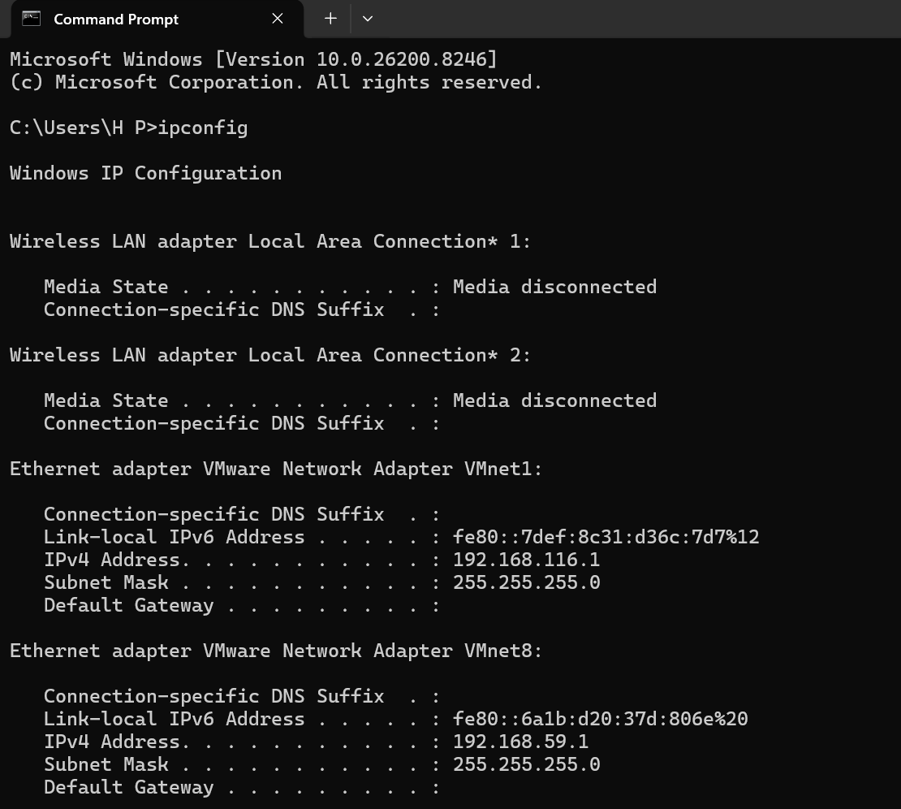
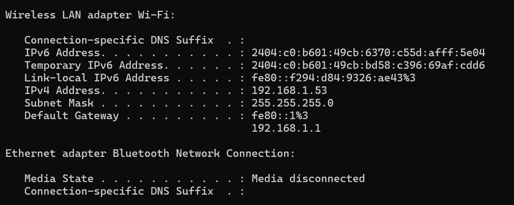
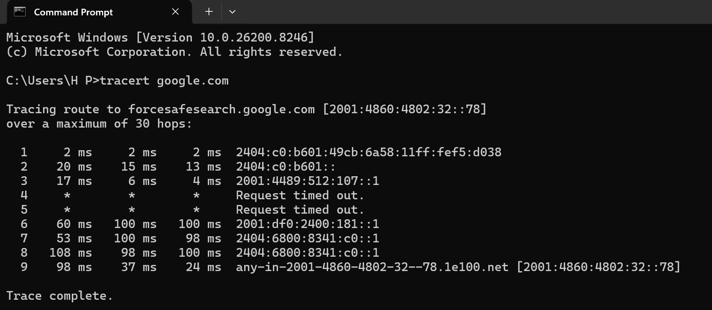
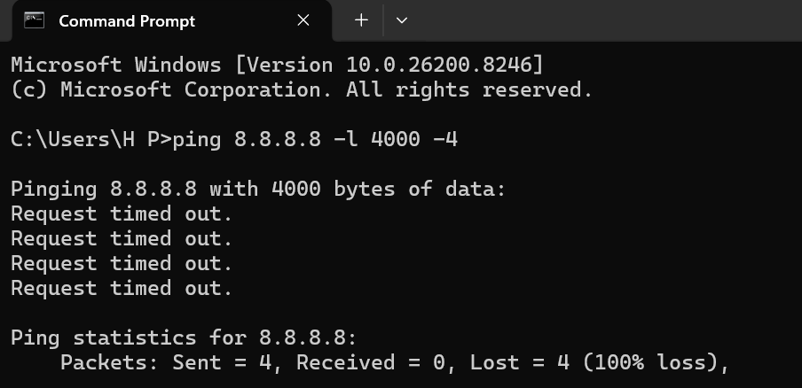
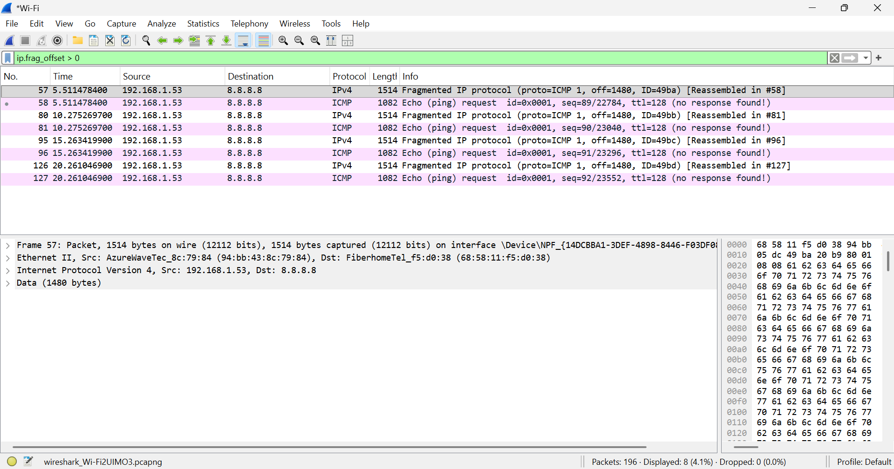
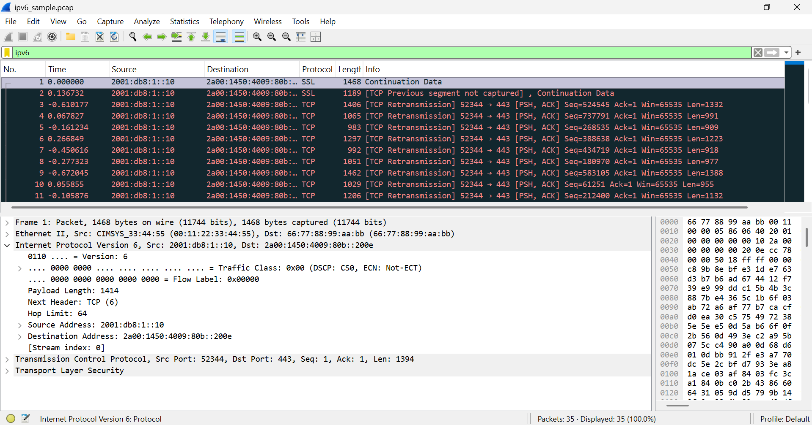

# MODUL 10 IP

## Tujuan Praktikum
1. Memahami konsep dasar Internet Protocol (IP) dalam jaringan komputer.
2. Mengetahui fungsi dan penggunaan IP address pada perangkat jaringan.
3. Menganalisis jalur paket dalam jaringan menggunakan perintah traceroute.
4. Memahami konsep ICMP, MTU, dan TTL dalam komunikasi jaringan.
5. Mengamati dan menganalisis fragmentasi paket menggunakan Wireshark.
6. Mengidentifikasi penggunaan IPv6 dalam jaringan melalui Wireshark.

## Apa itu IP Address
IP Address (Internet Protocol Address) adalah alamat unik yang digunakan untuk mengidentifikasi setiap perangkat dalam jaringan komputer. IP address berfungsi sebagai identitas perangkat serta alamat tujuan dalam proses pengiriman data, sehingga komunikasi antar perangkat dapat berjalan dengan baik.

Terdapat dua jenis IP address, yaitu IPv4 dan IPv6. IPv4 menggunakan format 32-bit dalam bentuk angka desimal, contohnya 192.168.1.1. Sedangkan IPv6 menggunakan format 128-bit berupa kombinasi angka dan huruf, contohnya 2404:c0::xxxx.

Untuk melihat IP address pada perangkat, digunakan perintah berikut pada Command Prompt : ipconfig

Berdasarkan hasil percobaan, diperoleh informasi IP address sebagai berikut:
- IPv4 Address: 192.168.1.53
- IPv6 Address: 2404:c0:b601:49cb:6370:c55d:afff:5e04
- Default Gateway: 192.168.1.1

Dari hasil tersebut dapat diketahui bahwa perangkat terhubung ke jaringan lokal menggunakan IPv4 dan juga memiliki alamat IPv6. Default gateway menunjukkan alamat router yang digunakan untuk mengakses jaringan luar (internet). Dengan demikian, IP address memiliki peran penting dalam proses komunikasi data karena memungkinkan perangkat saling terhubung dan bertukar informasi dalam jaringan.

## Traceroute dari suatu website
Website yang di gunakan google.com 

Berdasarkan hasil traceroute, paket yang dikirim dari perangkat menuju server Google melewati beberapa hop (router). Terlihat bahwa alamat yang digunakan adalah IPv6, ditunjukkan dengan format alamat seperti 2001:4860:4802:32::78. Jumlah hop yang dilewati sebanyak 9 hop sebelum mencapai tujuan. Beberapa hop menunjukkan respon waktu (delay) dalam milidetik, sedangkan pada hop ke-4 dan ke-5 terjadi Request timed out.

### Analisis
Traceroute bekerja dengan memanfaatkan nilai TTL (Time To Live) pada setiap paket. Setiap router yang dilewati akan mengurangi nilai TTL hingga mencapai nol, kemudian router tersebut akan mengirimkan pesan ICMP kembali ke pengirim.

Pada hasil yang diperoleh:
- Hop ke-1 hingga ke-3 menunjukkan jaringan lokal dan ISP
- Hop ke-4 dan ke-5 mengalami Request timed out, yang dapat disebabkan oleh router yang tidak merespon ICMP atau diblokir
- Hop selanjutnya kembali merespon hingga akhirnya mencapai server tujuan

Selain itu, hasil menunjukkan penggunaan IPv6, yang terlihat dari format alamat yang panjang dan menggunakan tanda titik dua (:). Hal ini menunjukkan bahwa jaringan yang digunakan sudah mendukung IPv6.

## Apa itu ICMP, MTU, TTL
### ICMP (Internet Control Message Protocol)
ICMP adalah protokol yang digunakan untuk mengirimkan pesan kesalahan (error) dan informasi dalam jaringan. ICMP tidak digunakan untuk mengirim data utama, tetapi untuk membantu proses komunikasi dan troubleshooting jaringan.

Contoh penggunaan ICMP adalah pada perintah ping dan traceroute, di mana ICMP digunakan untuk mengirimkan pesan seperti Echo Request, Echo Reply, dan Time Exceeded.

### MTU (Maximum Transmission Unit)
MTU adalah ukuran maksimum paket data yang dapat dikirim dalam satu frame tanpa perlu dilakukan fragmentasi. Jika ukuran data melebihi MTU, maka paket akan dipecah menjadi beberapa bagian yang disebut fragmentasi.

Contohnya, pada jaringan Ethernet, nilai MTU umumnya adalah 1500 byte.

### TTL (Time To Live)
TTL adalah nilai yang menunjukkan batas waktu atau jumlah lompatan (hop) yang dapat dilewati oleh sebuah paket di jaringan. Setiap kali paket melewati router, nilai TTL akan berkurang sebesar 1.

Jika nilai TTL mencapai nol, paket akan dibuang dan router akan mengirimkan pesan ICMP Time Exceeded ke pengirim.

Pada percobaan traceroute sebelumnya, terlihat bahwa proses traceroute memanfaatkan nilai TTL untuk mengetahui jalur paket. Ketika TTL habis, router mengirimkan pesan ICMP sebagai respon, sehingga setiap hop dalam jaringan dapat diketahui.

## Contoh fragmentasi pada wireshark
### Langkah-langkah :
1. Membuka aplikasi Wireshark dan memulai capture pada interface aktif
2. Mengirim paket berukuran besar melalui Command Prompt dengan perintah : ping 8.8.8.8 -l 4000 -4

3. Menghentikan capture pada Wireshark
4. Memasukkan filter : ip.frag_offset > 0
5. Mengamati paket yang muncul

Berdasarkan hasil pengamatan pada Wireshark, setelah dilakukan filter ip.frag_offset > 0, ditemukan beberapa paket yang mengalami fragmentasi. Terlihat paket dengan keterangan “Fragmented IP protocol” serta nilai fragment offset sebesar 1480, yang menunjukkan bahwa paket telah dipecah menjadi beberapa bagian. Selain itu, terdapat informasi “Reassembled” yang menunjukkan bahwa paket-paket tersebut dapat digabung kembali.

Fragmentasi terjadi karena ukuran paket yang dikirim (4000 byte) melebihi nilai MTU jaringan (sekitar 1500 byte). Oleh karena itu, paket harus dipecah menjadi beberapa bagian agar dapat dikirim melalui jaringan. Setiap fragment memiliki nilai fragment offset yang menunjukkan posisi potongan data dalam paket asli. Selain itu, flag “More Fragments” menunjukkan bahwa masih terdapat bagian lain dari paket tersebut.

Walaupun pada hasil ping di Command Prompt terjadi Request timed out, paket tetap terkirim dan dapat dianalisis di Wireshark. Fragmentasi terjadi ketika ukuran paket melebihi batas MTU. Pada percobaan ini, fragmentasi berhasil diamati di Wireshark melalui adanya fragment offset dan informasi paket terfragmentasi.

## IPV6 pada wireshark
### Langkah-langkah :
1. Membuka file "ipv6_sample.pcap" pada wireshark
2. Memasukkan filter : ipv6
3. Memilih salah satu paket yang muncul
4. Mengamati bagian Internet Protocol Version 6 (IPv6)

Setelah dilakukan filter ipv6, ditemukan beberapa paket yang menggunakan protokol IPv6.

Pada paket yang diamati, terlihat informasi sebagai berikut:
- Source Address: 2001:db8:1::10
- Destination Address: 2a00:1450:4009:80b::200e

Alamat tersebut menunjukkan bahwa paket menggunakan format IPv6 yang terdiri dari kombinasi angka dan huruf yang dipisahkan oleh tanda titik dua (:). IPv6 merupakan versi terbaru dari Internet Protocol yang menggunakan panjang alamat 128-bit. Berbeda dengan IPv4, IPv6 memiliki format alamat yang lebih panjang dan kompleks.

Pada hasil pengamatan di Wireshark, terlihat bahwa paket menggunakan Internet Protocol Version 6, yang dapat dikenali dari label tersebut serta adanya alamat source dan destination dengan format IPv6. Penggunaan IPv6 bertujuan untuk mengatasi keterbatasan jumlah alamat pada IPv4 serta meningkatkan efisiensi dalam pengalamatan jaringan.

