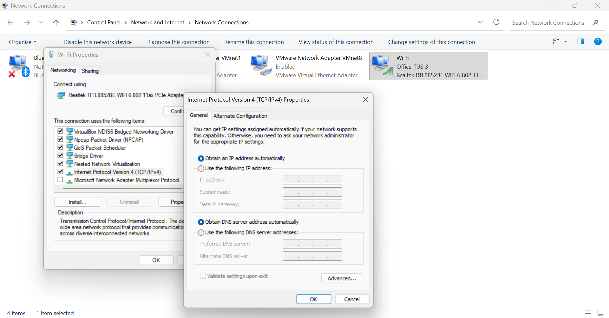
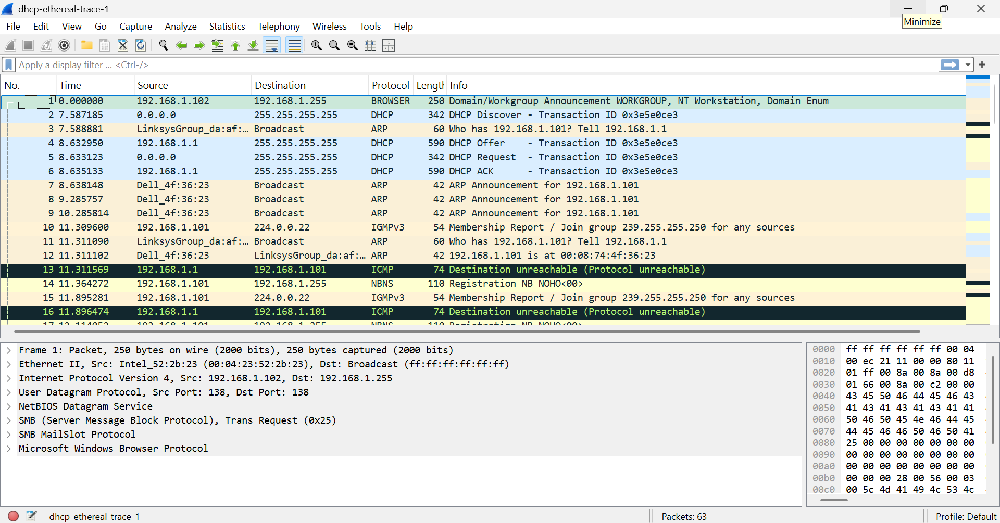
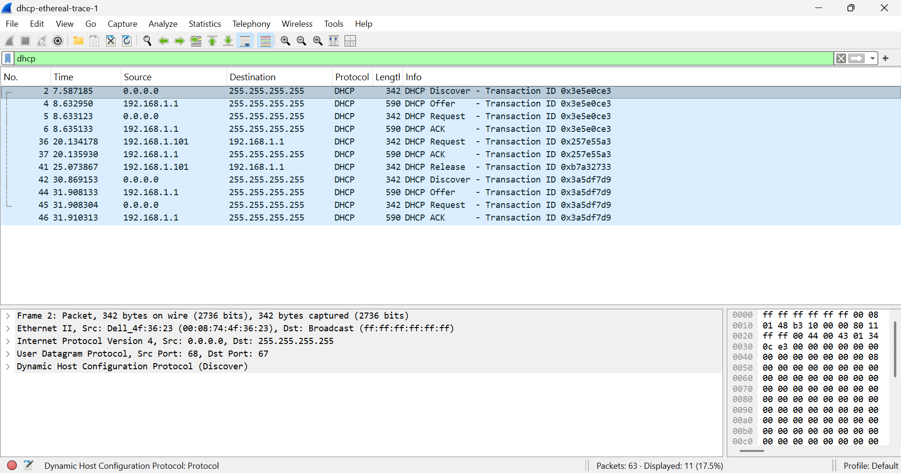

# MODUL 11 DHCP

## Apa itu DHCP
DHCP (Dynamic Host Configuration Protocol) adalah protokol jaringan yang digunakan untuk memberikan konfigurasi jaringan secara otomatis kepada perangkat yang terhubung ke jaringan, seperti komputer, laptop, maupun smartphone. Konfigurasi yang diberikan meliputi alamat IP, subnet mask, default gateway, dan DNS server. Dengan adanya DHCP, pengguna tidak perlu melakukan pengaturan alamat IP secara manual pada setiap perangkat, sehingga proses konfigurasi jaringan menjadi lebih cepat, mudah, dan efisien.

Pada gambar tersebut (Konfigurasi IPv4 pada Windows yang menggunakan DHCP untuk memperoleh alamat IP dan DNS secara otomatis), terlihat bahwa opsi “Obtain an IP address automatically” dan “Obtain DNS server address automatically” telah dipilih pada pengaturan Internet Protocol Version 4 (TCP/IPv4). Hal ini menunjukkan bahwa komputer dikonfigurasi untuk menggunakan DHCP. Dengan pengaturan tersebut, perangkat akan secara otomatis meminta konfigurasi jaringan dari DHCP Server setiap kali terhubung ke jaringan, tanpa perlu memasukkan alamat IP dan DNS secara manual.

## Kelebihan dan Kekurangan DHCP
### Kelebihan DHCP
1. Konfigurasi jaringan dilakukan secara otomatis
> DHCP secara otomatis memberikan alamat IP beserta parameter jaringan lainnya, seperti subnet mask, default gateway, dan DNS server, tanpa perlu diatur secara manual pada setiap perangkat.
2. Mempermudah pengelolaan jaringan
> Administrator jaringan dapat mengatur seluruh alokasi alamat IP dari satu DHCP Server, sehingga proses administrasi menjadi lebih sederhana dan terpusat.
3. Mencegah duplikasi alamat IP
> DHCP memastikan setiap perangkat memperoleh alamat IP yang berbeda, sehingga risiko terjadinya konflik alamat IP dapat diminimalkan.
4. Menghemat waktu dalam proses instalasi perangkat
> Saat perangkat baru terhubung ke jaringan, konfigurasi dapat dilakukan secara otomatis dalam waktu singkat tanpa memerlukan pengaturan tambahan dari pengguna.
5. Penggunaan alamat IP menjadi lebih efisien
> Alamat IP diberikan berdasarkan lease time, sehingga alamat yang sudah tidak digunakan dapat dialokasikan kembali kepada perangkat lain.
6. Mendukung mobilitas pengguna
> Laptop atau smartphone yang berpindah ke jaringan lain dapat otomatis mendapatkan konfigurasi yang sesuai.
7. Memudahkan perubahan konfigurasi jaringan
> Jika DNS server atau gateway berubah, administrator cukup memperbarui konfigurasi pada DHCP Server dan seluruh klien akan menerima pengaturan baru secara otomatis.

### Kekurangan DHCP
1. Ketergantungan pada DHCP Server
> Jika DHCP Server mengalami gangguan, perangkat klien tidak dapat memperoleh alamat IP secara otomatis.
2. Alamat IP dapat berubah sewaktu-waktu
> Perubahan alamat IP dapat menyulitkan pelacakan perangkat atau pengaturan layanan tertentu.
3. Kurang cocok untuk perangkat yang memerlukan IP tetap
> Server, printer jaringan, dan perangkat penting lainnya umumnya membutuhkan alamat IP statis.
4. Membutuhkan konfigurasi dan pemeliharaan server
> DHCP Server harus dikonfigurasi dengan benar agar distribusi alamat IP berjalan lancar.
5. Berpotensi menimbulkan risiko keamanan
> DHCP Server palsu (rogue DHCP server) dapat memberikan konfigurasi jaringan yang salah kepada klien.
6. Masalah lease time dapat memengaruhi ketersediaan alamat IP
> Lease time yang terlalu lama atau terlalu pendek dapat menyebabkan alokasi IP menjadi kurang optimal.

## DORA
DORA merupakan singkatan dari Discover, Offer, Request, dan Acknowledgment, yaitu empat tahapan utama yang terjadi ketika sebuah perangkat (client) meminta alamat IP secara otomatis dari DHCP Server. 

### Langkah-langkah
1. Membuka file dhcp-ethereal-trace-1 pada wireshark.
2. Gunakan filter "dhcp" untuk menampilkan paket dhcp.

Berdasarkan hasil capture pada Wireshark dengan filter dhcp, terlihat urutan paket DHCP yang menunjukkan proses DORA berlangsung dengan baik.

Pada gambar tersebut terlihat empat paket pertama yang menunjukkan proses DORA, yaitu:
1. DHCP Discover
> Paket ini dikirim oleh client dengan alamat sumber 0.0.0.0 ke alamat broadcast 255.255.255.255. Pada tahap ini, client belum memiliki alamat IP sehingga mengirimkan pesan untuk mencari DHCP Server yang tersedia di jaringan.
2. DHCP Offer
> Setelah menerima pesan Discover, DHCP Server dengan alamat IP 192.168.1.1 merespons dengan mengirimkan pesan Offer. Paket ini berisi tawaran alamat IP yang dapat digunakan oleh client beserta informasi jaringan lainnya, seperti subnet mask, default gateway, dan DNS server.
3. DHCP Request
> Client kemudian mengirimkan pesan Request ke alamat broadcast untuk menyatakan bahwa client menerima tawaran alamat IP yang diberikan oleh DHCP Server dan meminta agar alamat tersebut secara resmi dialokasikan.
4. DHCP ACK (Acknowledgment)
> DHCP Server mengirimkan pesan ACK sebagai konfirmasi bahwa permintaan client telah disetujui. Pada tahap ini, alamat IP beserta konfigurasi jaringan lainnya diberikan kepada client, sehingga perangkat dapat mulai terhubung ke jaringan.

Berdasarkan hasil pengamatan pada Wireshark, proses DORA berlangsung secara berurutan dan berhasil. DHCP Server yang digunakan memiliki alamat IP 192.168.1.1, sedangkan client pada awal proses belum memiliki alamat IP sehingga menggunakan alamat 0.0.0.0. Setelah tahap ACK selesai, client memperoleh konfigurasi jaringan secara otomatis dan dapat menggunakan jaringan dengan normal.

