# MODUL 4 DNS
## NSLOOKUP

### Pertanyaan
1. Jalankan nslookup untuk mendapatkan alamat IP dari server web di Asia. Berapa alamat IP
server tersebut?

Perintah yang digunakan: nslookup www.nus.edu.sg 8.8.8.8.
Perintah tersebut dijalankan menggunakan DNS server 8.8.8.8 (Google Public DNS) karena DNS default pada perangkat mengalami request timed out, sehingga digunakan DNS publik agar proses resolusi domain dapat berjalan dengan normal.

Setelah perintah dijalankan, diperoleh hasil sebagai berikut:
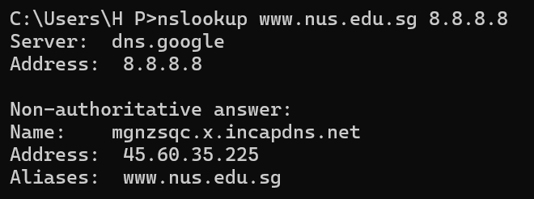

Berdasarkan hasil tersebut, alamat IP dari server web di Asia (www.nus.edu.sg) adalah 45.60.35.225.
Perintah nslookup berhasil digunakan untuk mencari alamat IP domain www.nus.edu.sg. Hasil menunjukkan bahwa domain tersebut diarahkan ke host mgnzsqc.x.incapdns.net dengan alamat IP 45.60.35.225.

2. Jalankan nslookup agar dapat mengetahui server DNS otoritatif untuk universitas di Eropa.

Perintah yang digunakan: nslookup -type=NS ox.ac.uk 8.8.8.8, 
Perintah tersebut dijalankan menggunakan DNS server 8.8.8.8 (Google Public DNS) karena DNS default pada perangkat mengalami request timed out.

Setelah perintah dijalankan, diperoleh hasil sebagai berikut:
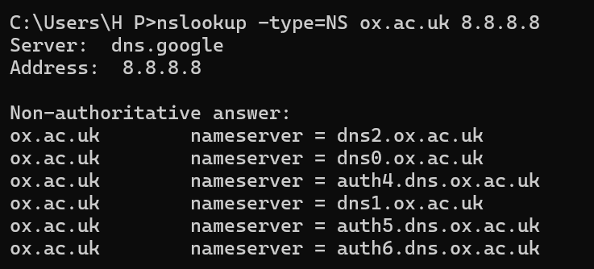

Berdasarkan hasil tersebut, Server DNS otoritatif untuk domain universitas di Eropa (ox.ac.uk) adalah dns2.ox.ac.uk, dns0.ox.ac.uk, auth4.dns.ox.ac.uk, dns1.ox.ac.uk, auth5.dns.ox.ac.uk, dan auth6.dns.ox.ac.uk.
Perintah nslookup -type=NS berhasil digunakan untuk menampilkan server DNS otoritatif dari domain ox.ac.uk. Hasil menunjukkan beberapa name server yang bertanggung jawab menangani domain tersebut.

3. Jalankan nslookup untuk mencari tahu informasi mengenai server email dari Yahoo! Mail melalui salah satu server yang didapatkan di pertanyaan nomor 2. Apa alamat IP-nya?

Sesuai instruksi soal, pertama dilakukan pencarian informasi server email Yahoo! Mail menggunakan salah satu name server yang diperoleh pada pertanyaan nomor 2, yaitu auth0.dns.ox.ac.uk, dengan perintah berikut: nslookup -type=MX yahoo.com auth0.dns.ox.ac.uk

Hasil yang diperoleh adalah:
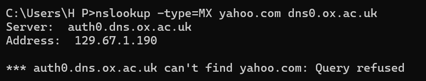

Hasil tersebut menunjukkan bahwa server auth0.dns.ox.ac.uk menolak permintaan pencarian terhadap domain yahoo.com. Hal ini terjadi karena server tersebut merupakan DNS otoritatif yang hanya melayani domain tertentu, yaitu domain milik ox.ac.uk, sehingga tidak mengizinkan query untuk domain lain.
Karena query ditolak, maka dilakukan verifikasi menggunakan DNS publik Google Public DNS (8.8.8.8) untuk mendapatkan informasi mail server Yahoo! Mail, dengan perintah: nslookup -type=MX yahoo.com 8.8.8.8

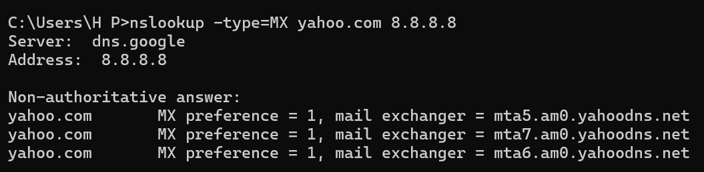

Dari hasil tersebut diperoleh beberapa mail server (MX record) Yahoo! Mail, salah satunya adalah: mta5.am0.yahoodns.net.
Selanjutnya, untuk mengetahui alamat IP dari server email tersebut, dilakukan pencarian dengan perintah: nslookup mta5.am0.yahoodns.net 8.8.8.8

Hasil yang diperoleh adalah:

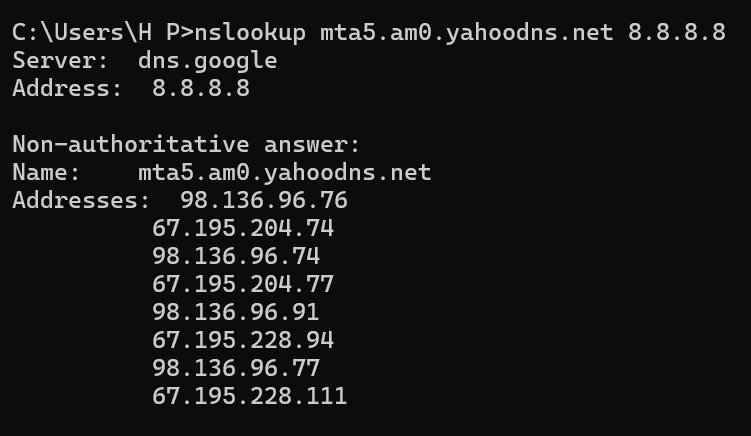

Berdasarkan hasil tersebut, alamat IP salah satu server email Yahoo! Mail adalah: 98.136.96.76
Selain itu, server mta5.am0.yahoodns.net juga memiliki beberapa alamat IP lain seperti gambar.
Dengan demikian, dapat disimpulkan bahwa informasi server email Yahoo! Mail dapat diketahui melalui pencarian MX record, dan salah satu alamat IP server email Yahoo! Mail adalah 98.136.96.76.

## Tracing DNS dengan Wireshark
### Langkah-Langkah
1. Membuka Command Prompt dan menjalankan perintah ipconfig untuk mengetahui alamat IP (192.168.1.53)
2. Mengosongkan DNS cache dengan perintah: ipconfig /flushdns
3. Membuka Wireshark dan memilih interface jaringan aktif (Wi-Fi).
4. Memasukkan filter: ip.addr == 192.168.1.53
5. Menjalankan capture paket.
6. Membuka browser dan mengakses: http://www.ietf.org
7. Menghentikan capture.
8. Menambahkan filter untuk menampilkan DNS spesifik: dns && dns.qry.name contains "ietf"

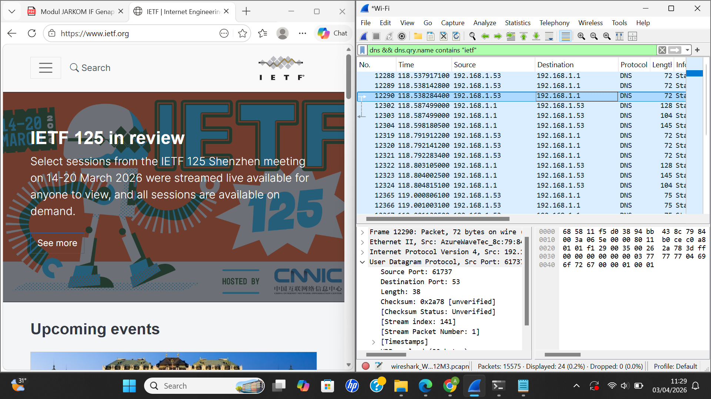

### Pertanyaan
1. Cari pesan permintaan DNS dan balasannya. Apakah pesan tersebut dikirimkan melalui UDP atau TCP?

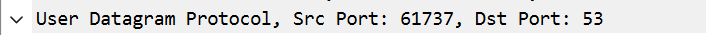

Pesan permintaan DNS dan balasannya dikirimkan menggunakan UDP (User Datagram Protocol). Hal ini dapat dilihat pada detail paket di Wireshark yang menunjukkan adanya layer UDP pada kedua paket tersebut.

2. Apa port tujuan pada pesan permintaan DNS? Apa port sumber pada pesan balasannya?

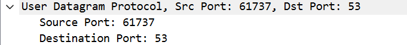
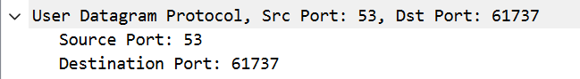

Port tujuan pada pesan permintaan DNS adalah 53, yang merupakan port standar untuk layanan DNS.
Sedangkan port sumber pada pesan balasan DNS juga 53, karena balasan dikirim oleh server DNS.

3. Pada pesan permintaan DNS, apa alamat IP tujuannya? Apa alamat IP server DNS lokal anda (gunakan ipconfig untuk mencari tahu)? Apakah kedua alamat IP tersebut sama?

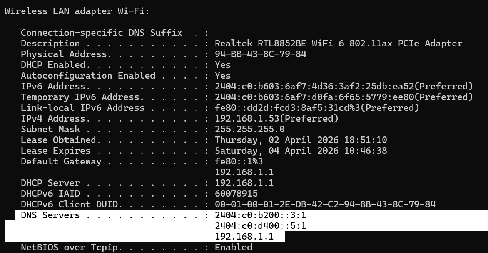
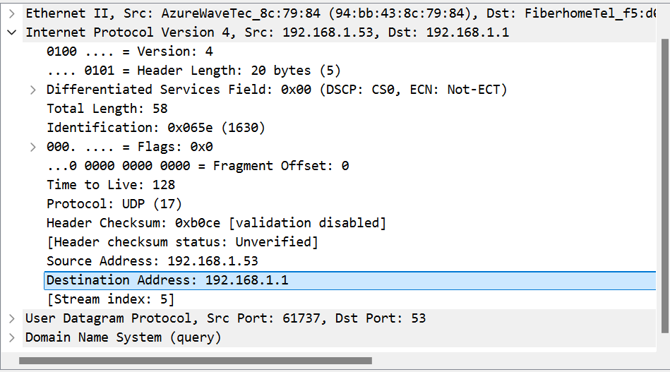

Alamat IP tujuan pada pesan permintaan DNS adalah 192.168.1.1.
Berdasarkan hasil perintah ipconfig /all, alamat IP server DNS lokal adalah 192.168.1.1.
Kedua alamat IP tersebut sama, karena permintaan DNS dikirimkan ke server DNS lokal.

4. Periksa pesan permintaan DNS. Apa “type” dari pesan tersebut? Apakah pesan permintaan tersebut mengandung “answers”?

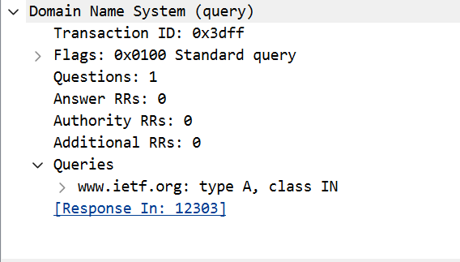

Type pada pesan permintaan DNS adalah A (Host Address), yang digunakan untuk meminta alamat IP (IPv4) dari domain www.ietf.org.
Pesan permintaan DNS tersebut tidak mengandung answers, yang ditunjukkan dengan nilai Answer RRs: 0, karena paket tersebut merupakan permintaan (query).

5. Periksa pesan balasan DNS. Berapa banyak “answers” yang terdapat di dalamnya? Apa saja isi yang terkandung dalam setiap jawaban tersebut?

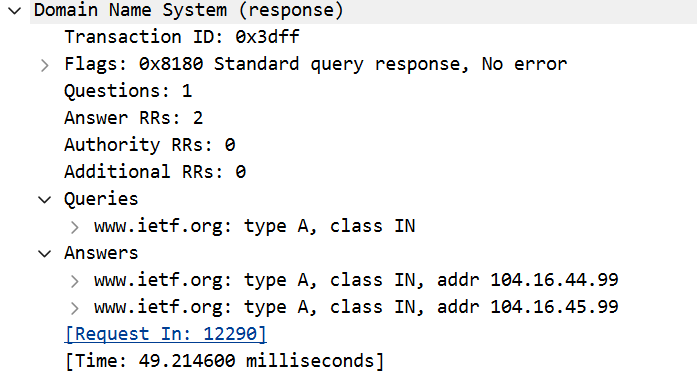

Pada pesan balasan DNS terdapat 2 answers, yang ditunjukkan oleh nilai Answer RRs: 2.
Setiap answer berisi informasi berupa nama domain, tipe record, dan alamat IP hasil resolusi.
Adapun isi dari masing-masing answer adalah:
www.ietf.org → Type A → Address: 104.16.44.99
www.ietf.org → Type A → Address: 104.16.45.99

6. Perhatikan paket TCP SYN yang selanjutnya dikirimkan oleh host Anda. Apakah alamat IP pada paket tersebut sesuai dengan alamat IP yang tertera pada pesan balasan DNS?

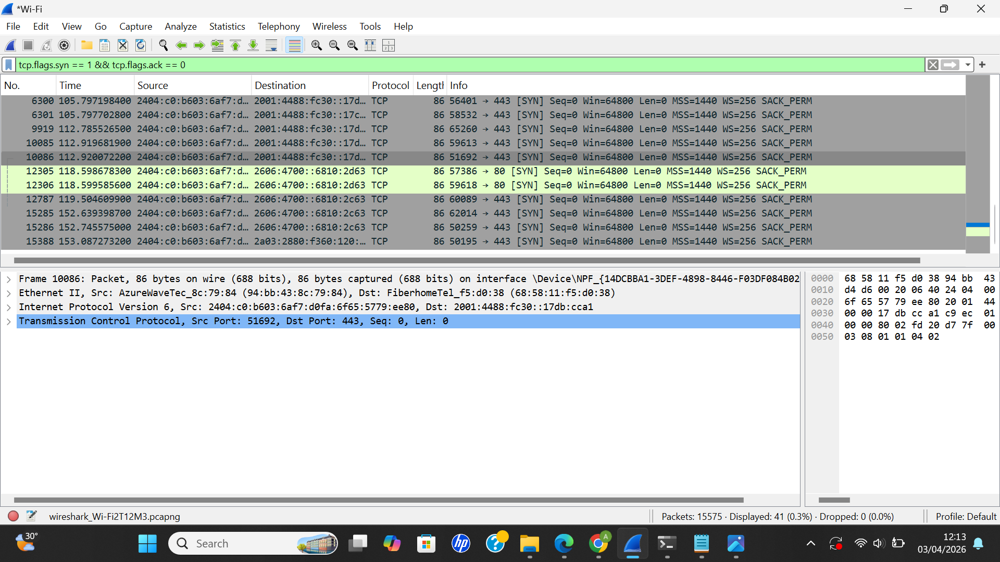

Alamat IP pada paket TCP SYN tidak sama secara langsung dengan alamat IP pada pesan balasan DNS yang berupa IPv4.
Hal ini dikarenakan sistem menggunakan IPv6 untuk melakukan koneksi ke server, sehingga paket TCP SYN dikirim ke alamat IPv6.
Meskipun berbeda format (IPv4 dan IPv6), keduanya tetap berasal dari hasil resolusi DNS terhadap domain yang sama.

7. Halaman web yang sebelumnya Anda akses (http://www.ietf.org) memuat beberapa gambar. Apakah host Anda perlu mengirimkan pesan permintaan DNS baru setiap kali ingin mengakses suatu gambar?

Host tidak perlu mengirimkan pesan permintaan DNS baru setiap kali mengakses gambar jika gambar tersebut berasal dari domain yang sama dengan halaman utama, karena alamat IP sudah diketahui atau tersimpan dalam cache.
Namun, jika gambar berasal dari domain yang berbeda, maka host perlu melakukan permintaan DNS baru untuk mengetahui alamat IP dari domain tersebut.

## Tracing DNS dengan nslookup
### Langkah-Langkah
1. Membuka Wireshark dan memilih interface jaringan aktif (Wi-Fi).
2. Menjalankan proses capture paket (Start).
3. Membuka Command Prompt.
4. Menjalankan perintah: nslookup www.mit.edu 192.168.1.1
5. Kembali ke Wireshark dan menghentikan proses capture (Stop).
6. Memasukkan filter untuk menampilkan paket DNS: dns
7. Menambahkan filter untuk mempermudah pencarian: dns && dns.qry.name contains "mit"
8. Mengidentifikasi paket DNS query dan response untuk domain www.mit.edu, dan memilih pasangan terakhir sesuai instruksi modul.

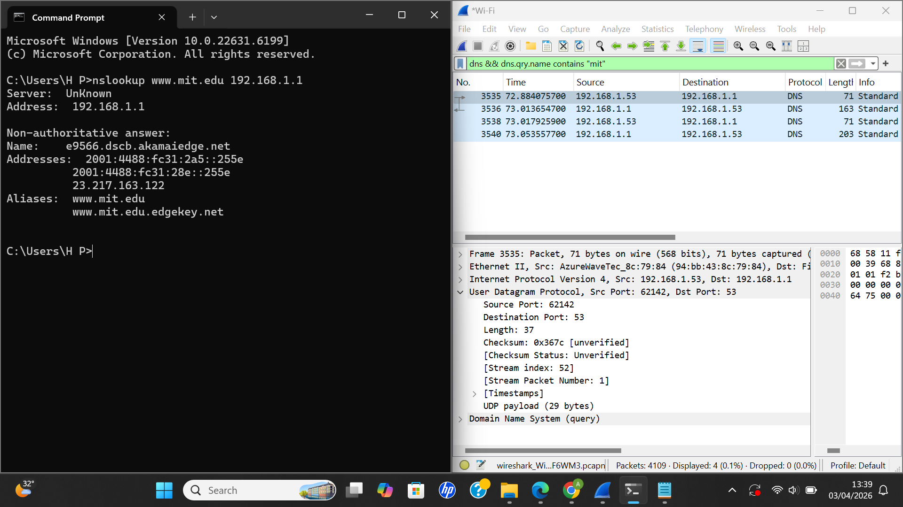

## Pertanyaan
1. Apa port tujuan pada pesan permintaan DNS? Apa port sumber pada pesan balasan DNS?

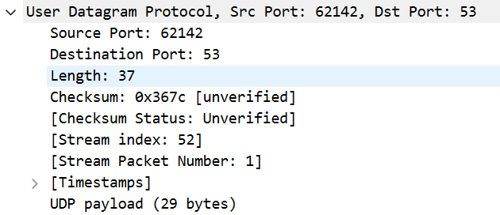
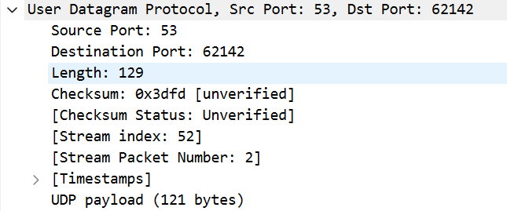

Port tujuan pada pesan permintaan DNS adalah 53, sedangkan port sumber pada pesan balasan DNS juga 53, karena server DNS menggunakan port tersebut untuk menerima dan mengirim balasan.

2. Ke alamat IP manakah pesan permintaan DNS dikirimkan? Apakah alamat IP tersebut merupakan default alamat IP server DNS lokal Anda?

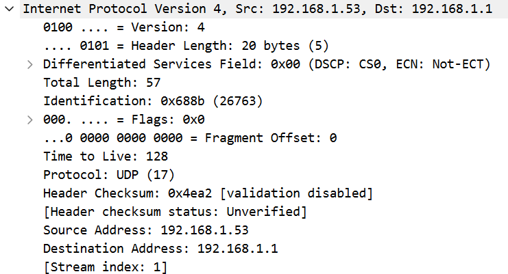

Pesan permintaan DNS dikirimkan ke alamat IP 192.168.1.1.
Alamat tersebut merupakan alamat IP server DNS lokal (default), sesuai dengan hasil perintah ipconfig /all.

3. Periksa pesan permintaan DNS. Apa “type” dari pesan tersebut? Apakah pesan tersebut mengandung “jawaban” atau “answers”?

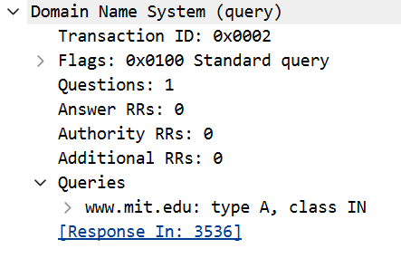

Type dari pesan permintaan DNS adalah A (Host Address).
Pesan tersebut tidak mengandung jawaban (answers), yang ditunjukkan dengan nilai Answer RRs: 0, karena merupakan pesan permintaan dari client ke server DNS.

4. Periksa pesan balasan DNS. Berapa banyak “answers” yang terdapat di dalamnya? Apa saja isi yang terkandung dalam setiap jawaban tersebut?

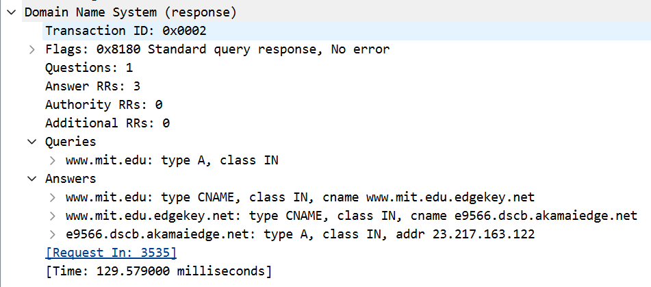

Pada pesan balasan DNS terdapat 3 answers, yang ditunjukkan oleh nilai Answer RRs: 3.
Setiap answer berisi informasi berupa nama domain, tipe record, dan hasil resolusi.
Adapun isi dari masing-masing answer adalah:

www.mit.edu → Type CNAME → www.mit.edu.edgekey.net
www.mit.edu.edgekey.net → Type CNAME → e9566.dscb.akamaiedge.net
e9566.dscb.akamaiedge.net → Type A → Address: 23.217.163.122

## NSLOOKUP TYPE NS
### Langkah-Langkah
1. Membuka Wireshark dan memilih interface jaringan aktif (Wi-Fi).
2. Menjalankan proses capture paket (Start).
3. Membuka Command Prompt.
4. Menjalankan perintah: nslookup -type=NS mit.edu 192.168.1.1
5. Kembali ke Wireshark dan menghentikan proses capture (Stop).
6. Memasukkan filter: dns
7. Menambahkan filter untuk mempermudah pencarian:Menambahkan filter untuk mempermudah pencarian: dns && dns.qry.name contains "mit"
8. Mengidentifikasi paket DNS query dan response untuk domain mit.edu.

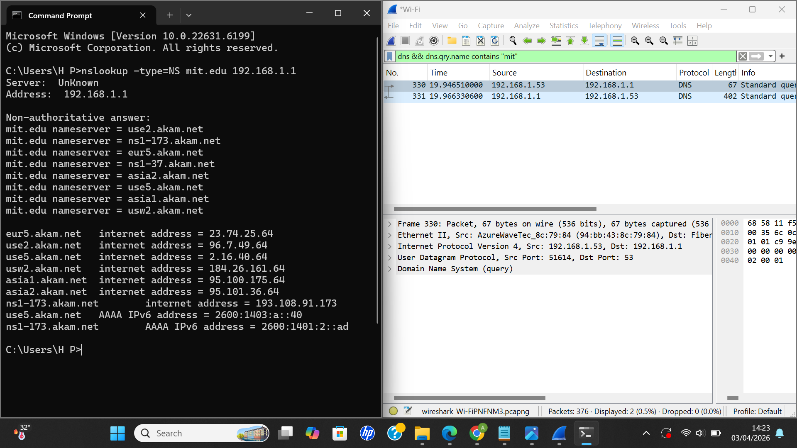

### Pertanyaan
1. Ke alamat IP manakah pesan permintaan DNS dikirimkan? Apakah alamat IP tersebut merupakan default alamat IP server DNS lokal Anda?

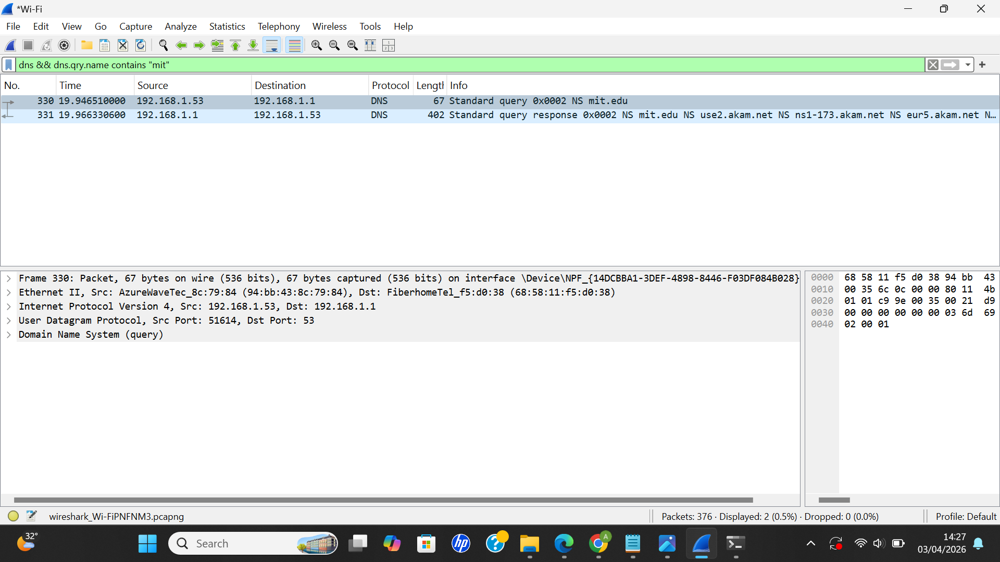

Pesan permintaan DNS dikirimkan ke alamat IP 192.168.1.1.
Alamat tersebut merupakan alamat IP server DNS lokal (default), sesuai dengan konfigurasi DNS pada sistem.

2. Periksa pesan permintaan DNS. Apa “type” dari pesan tersebut? Apakah pesan tersebut mengandung “jawaban” atau “answers”?

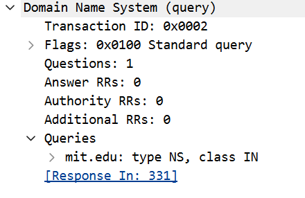

Type dari pesan permintaan DNS adalah NS (Name Server).
Pesan tersebut tidak mengandung jawaban (answers), yang ditunjukkan dengan nilai Answer RRs: 0, karena merupakan pesan permintaan dari client ke server DNS.

3. Periksa pesan balasan DNS. Apa nama server MIT yang diberikan oleh pesan balasan? Apakah pesan balasan ini juga memberikan alamat IP untuk server MIT tersebut?

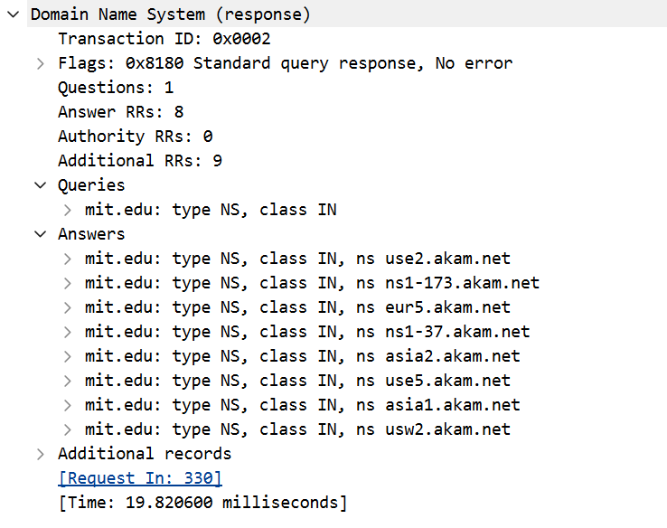

Pesan balasan DNS memberikan beberapa nama server (Name Server) untuk domain MIT, antara lain use2.akam.net, ns1-173.akam.net, eur5.akam.net, dan lainnya.
Pesan balasan ini tidak memberikan alamat IP secara langsung untuk server tersebut, karena hanya berisi informasi Name Server (NS).

## nslookup www.aiit.or.kr bitsy.mit.edu
### Langkah-Langkah
1. Membuka Wireshark dan memilih interface jaringan aktif (Wi-Fi).
2. Menjalankan proses capture paket (Start).
3. Membuka Command Prompt (CMD).
4. Menjalankan perintah: nslookup www.aiit.or.kr bitsy.mit.edu
5. Mengamati hasil yang muncul pada CMD.

Pada percobaan menggunakan server bitsy.mit.edu terjadi timeout karena server tidak merespon. Oleh karena itu, digunakan DNS server publik (8.8.8.8) agar proses analisis DNS tetap dapat dilakukan.

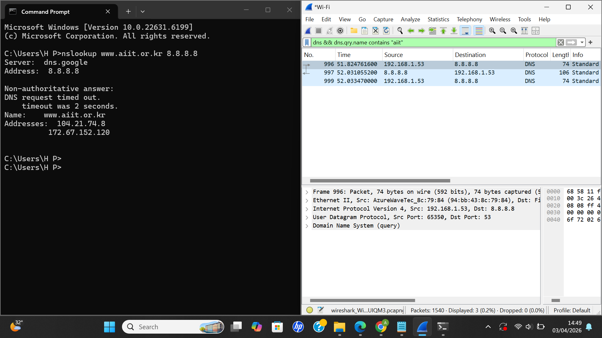

### Pertanyaan
1. Ke alamat IP manakah pesan permintaan DNS dikirimkan? Apakah alamat IP tersebut
merupakan default alamat IP server DNS lokal Anda?

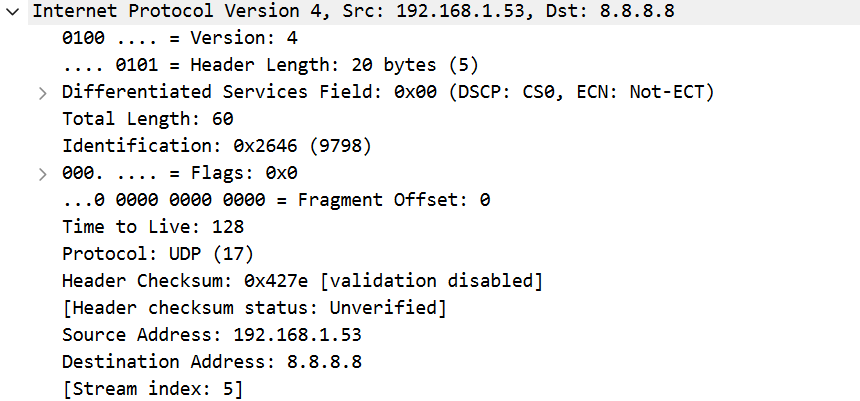

Pesan permintaan DNS dikirimkan ke alamat IP 8.8.8.8, yaitu DNS server publik milik Google.
Alamat tersebut bukan merupakan default DNS server lokal, karena DNS lokal yang digunakan sebelumnya adalah 192.168.1.1.

2. Periksa pesan permintaan DNS. Apa “type” dari pesan tersebut? Apakah pesan tersebut mengandung “jawaban” atau “answers”?

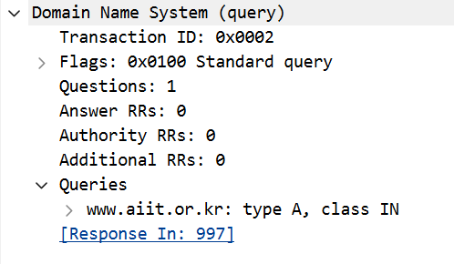

Type dari pesan permintaan DNS adalah A (Host Address).
Pesan tersebut tidak mengandung jawaban (answers), yang ditunjukkan dengan nilai Answer RRs: 0, karena merupakan pesan permintaan dari client ke server DNS.

3. Periksa pesan balasan DNS. Berapa banyak “jawaban” (answers) yang terdapat di dalamnya? Apa saja isi yang terkandung dalam setiap jawaban tersebut?

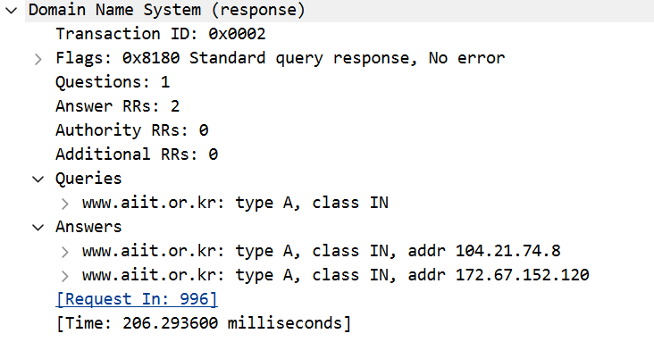

Pada pesan balasan DNS terdapat 2 answers, yang ditunjukkan oleh nilai Answer RRs: 2.
Setiap answer berisi alamat IP hasil resolusi dari domain www.aiit.or.kr.
Adapun isi dari masing-masing jawaban adalah:

www.aiit.or.kr → Address: 104.21.74.8
www.aiit.or.kr → Address: 172.67.152.120