# MODUL 6 TCP
Menangkap Tansfer TCP dalam Jumlah Besar dari Komputer Pribadi ke Remote Server.

## Analisis Transfer File Menggunakan Protokol TCP
### Langkah-langkah
1. Download file alice.txt pada link berikut, http://gaia.cs.umass.edu/wireshark-labs/alice.txt

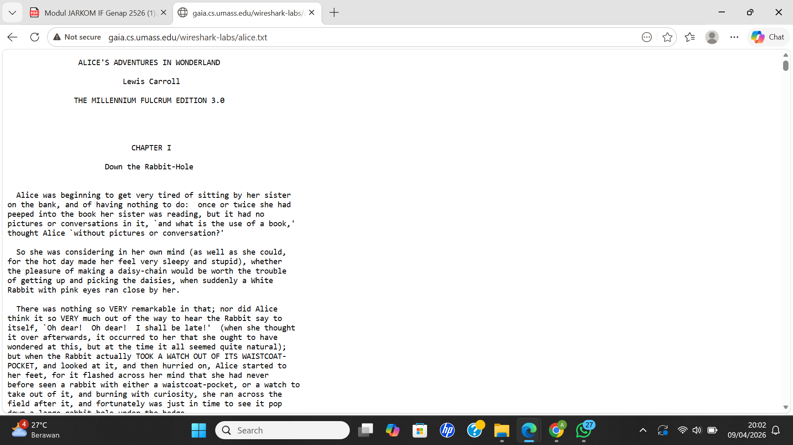

2. Buka halaman http://gaia.cs.umass.edu/wireshark-labs/TCP-wireshark-file1.html, lalu masukan file yg sudah di download (choose file)

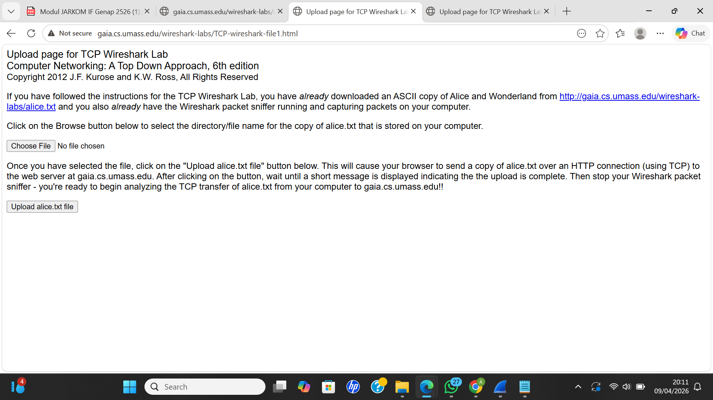

3. Jalankan wireshark, lalu start capture dan Kembali ke browser lalu klik "Upload alice.txt file", Stop capture setelah selesai upload file.

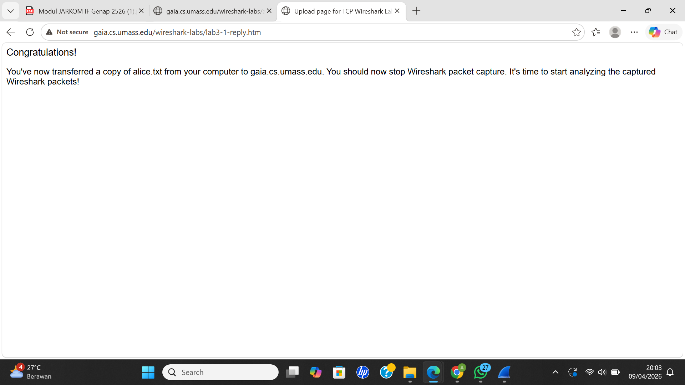

4. filter "tcp contains "POST"" pada wireshark, tujuannya menemukan paket upload

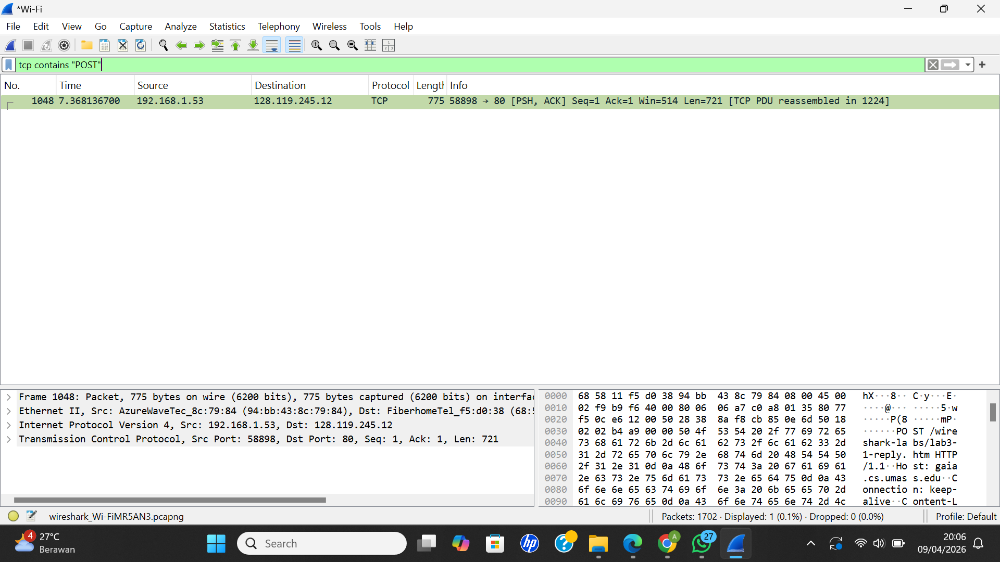

### Pertanyaan
1. Berapa alamat IP dan nomor port TCP yang digunakan oleh komputer klien (sumber) untuk 
mentransfer file ke gaia.cs.umass.edu? 

.png)
.png)

Berdasarkan hasil analisis paket HTTP POST pada Wireshark, komputer klien menggunakan alamat IP 192.168.1.53 dan nomor port 58898 untuk mentransfer file ke server.

2. Apa alamat IP dari gaia.cs.umass.edu? Pada nomor port berapa ia mengirim dan menerima 
segmen TCP untuk koneksi ini?

.png)
.png)

Server gaia.cs.umass.edu memiliki alamat IP 128.119.245.12 dan menggunakan port 80 untuk komunikasi TCP karena menggunakan protokol HTTP.

3. Berapa alamat IP dan nomor port TCP yang digunakan oleh komputer klien Anda (sumber) 
untuk mentransfer  ke gaia.cs.umass.edu? 

.png)
.png)

Berdasarkan hasil capture pada Wireshark, alamat IP tujuan (gaia.cs.umass.edu) adalah 128.119.245.12. Hasil ini diverifikasi menggunakan perintah nslookup gaia.cs.umass.edu 8.8.8.8, yang menunjukkan alamat IP yang sama. Dengan demikian, alamat IP pada Wireshark sesuai dengan hasil resolusi DNS.

## DASAR TCP
### Langkah-langkah
1. Download dan extrak file http://gaia.cs.umass.edu/wireshark-labs/wireshark-traces.zip
2. Buka file tcp-ethereal-trace-1 dengan wireshark

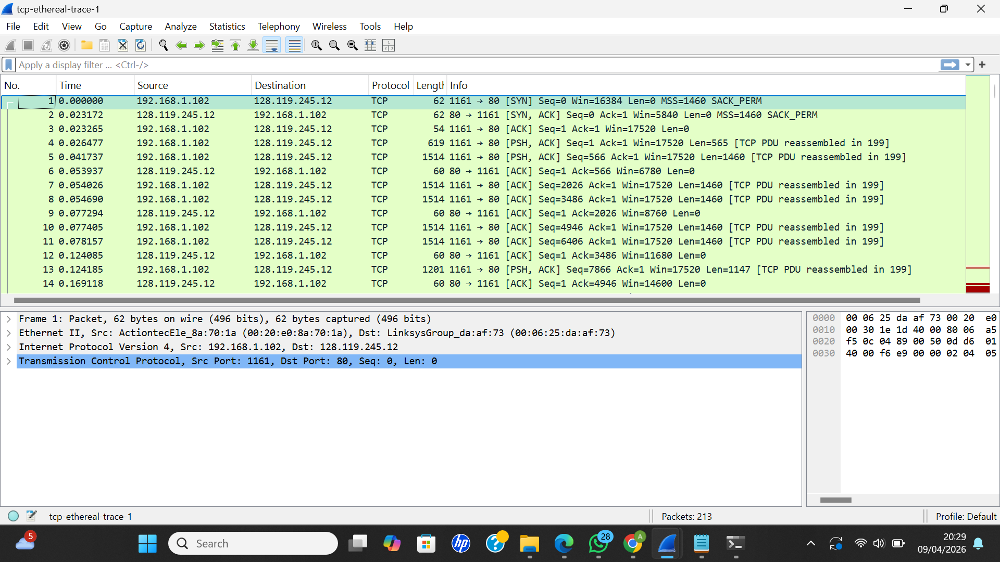

### Pertanyaan
1. Berapa nomor urut segmen TCP SYN yang digunakan untuk memulai sambungan TCP antara komputer klien dan gaia.cs.umass.edu? Apa yang dimiliki segmen tersebut sehingga teridentifikasi sebagai segmen SYN? 

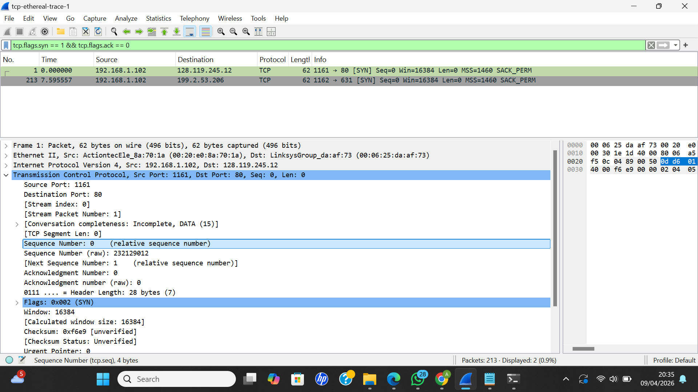

Berdasarkan hasil filter menggunakan tcp.flags.syn == 1 && tcp.flags.ack == 0, diperoleh segmen TCP SYN dengan Sequence Number sebesar 0. Segmen ini diidentifikasi sebagai SYN karena memiliki flag SYN = 1 dan ACK = 0, yang menunjukkan bahwa segmen tersebut merupakan awal dari proses pembentukan koneksi TCP (three-way handshake).

2. Berapa nomor urut segmen SYNACK yang dikirim oleh gaia.cs.umass.edu ke komputer klien sebagai balasan dari SYN? Berapa nilai dari field Acknowledgement pada segmen SYNACK? Bagaimana gaia.cs.umass.edu menentukan nilai tersebut? Apa yang dimiliki oleh segmen sehingga teridentifikasi sebagai segmen SYNACK? 

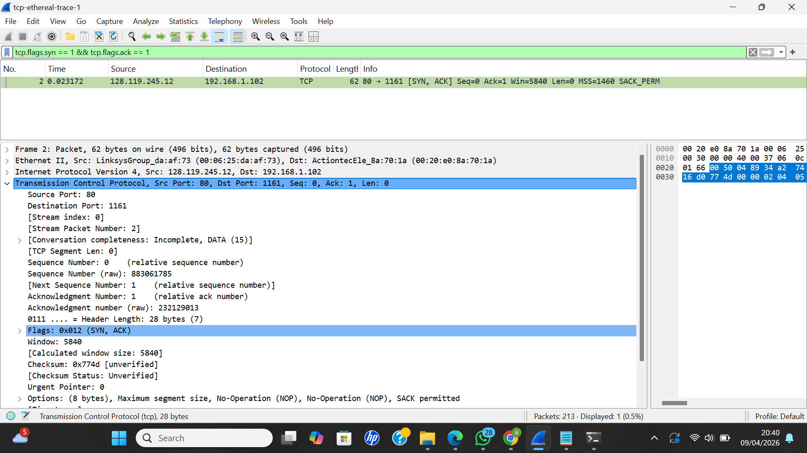

Berdasarkan hasil filter menggunakan tcp.flags.syn == 1 && tcp.flags.ack == 1, diperoleh segmen TCP SYN-ACK dengan Sequence Number sebesar 0 dan Acknowledgement Number sebesar 1. Nilai ACK diperoleh dari Sequence Number segmen SYN sebelumnya yang bernilai 0, kemudian ditambahkan 1. Segmen ini diidentifikasi sebagai SYN-ACK karena memiliki flag SYN = 1 dan ACK = 1, yang menunjukkan bahwa server merespons permintaan koneksi dari klien dalam proses three-way handshake.

3. Berapa nomor urut segmen TCP yang berisi perintah HTTP POST? 

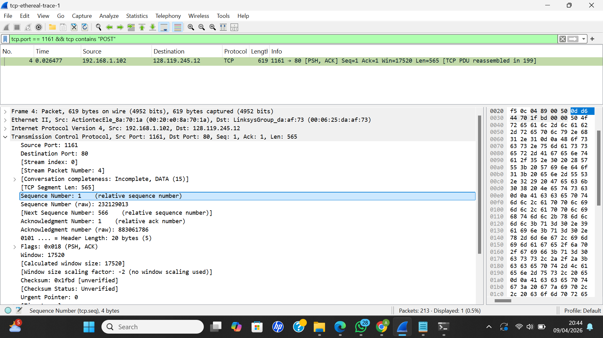

Berdasarkan hasil filter menggunakan tcp.port == 1161 && tcp contains "POST", diperoleh segmen TCP yang berisi perintah HTTP POST dengan Sequence Number sebesar 1. Segmen ini merupakan awal pengiriman data dari klien ke server setelah proses three-way handshake selesai.

4. Hitung RTT, waktu kirim, waktu ACK, dan Estimated RTT

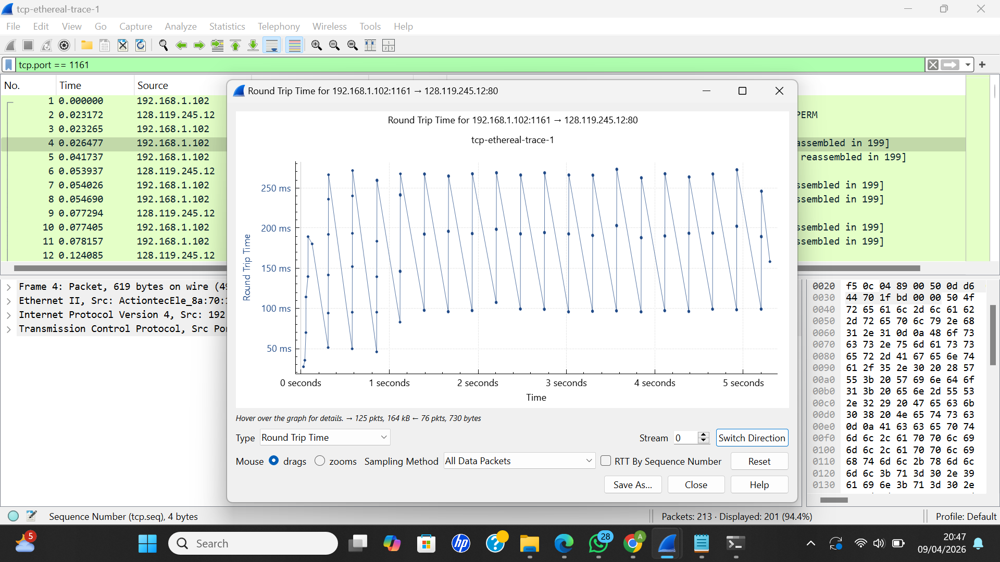

Berdasarkan hasil analisis menggunakan filter tcp.port == 1161 dan fitur Statistics → TCP Stream Graph → Round Trip Time, diperoleh bahwa nilai RTT (Round Trip Time) berkisar antara sekitar 50 ms hingga 270 ms. Nilai RTT diperoleh dari selisih waktu antara pengiriman segmen TCP oleh klien dan penerimaan acknowledgement (ACK) dari server. Variasi nilai RTT dipengaruhi oleh kondisi jaringan selama proses transmisi data.

5. Berapa panjang setiap enam segmen TCP pertama?

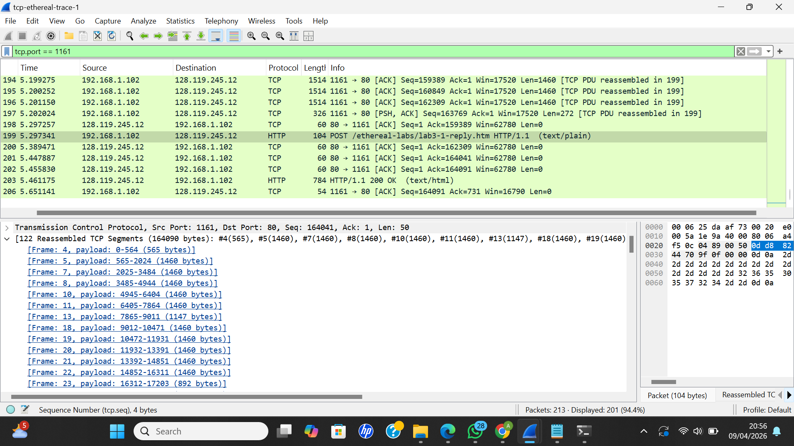

Berdasarkan hasil analisis menggunakan filter tcp.port == 1161, panjang enam segmen TCP pertama diperoleh dari bagian Reassembled TCP Segments, yaitu sebesar 565 byte, 1460 byte, 1460 byte, 1460 byte, 1460 byte, dan 1460 byte. Jika dijumlahkan, total panjang keenam segmen tersebut adalah 7865 byte.

6. Berapa jumlah minimum ruang buffer tersedia yang disarankan kepada penerima dan diterima untuk seluruh trace? Apakah kurangnya ruang buffer penerima pernah menghambat pengiriman? 

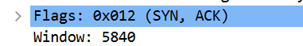

Berdasarkan hasil analisis menggunakan filter tcp.port == 1161, nilai minimum ruang buffer (window size) yang diterima adalah sebesar 5840 byte. Nilai ini menunjukkan kapasitas buffer yang tersedia pada sisi penerima. Selama proses transmisi, tidak ditemukan indikasi bahwa kekurangan ruang buffer menghambat pengiriman data, karena tidak terlihat adanya penundaan atau retransmission akibat window yang penuh.

7. Apakah ada segmen yang ditransmisikan ulang dalam file trace? 

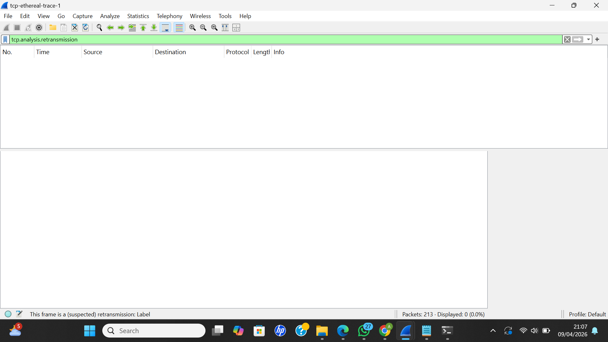

Segmen retransmission dicek menggunakan filter tcp.analysis.retransmission pada Wireshark. Berdasarkan hasil filter, tidak ditemukan adanya segmen yang ditransmisikan ulang dalam trace, sehingga dapat disimpulkan bahwa tidak terjadi retransmission selama proses komunikasi TCP.

8. Berapa banyak data yang biasanya diakui oleh penerima dalam ACK? Dapatkah anda mengidentifikasi kasus-kasus di mana penerima melakukan ACK untuk setiap segmen yang diterima? 

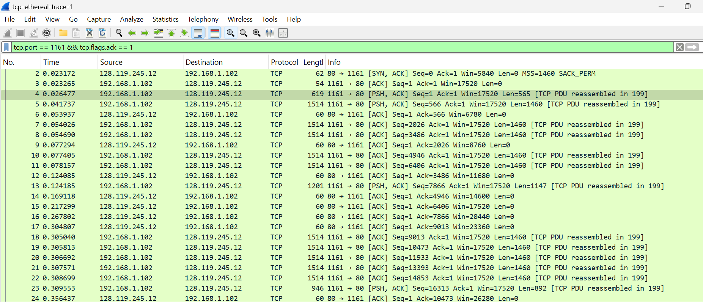

Berdasarkan hasil analisis menggunakan filter tcp.port == 1161 && tcp.flags.ack == 1, terlihat bahwa nilai acknowledgment number meningkat dalam jumlah besar setiap kali ACK dikirim, sehingga menunjukkan bahwa penerima mengakui beberapa segmen sekaligus. Dengan demikian, penerima tidak selalu mengirim ACK untuk setiap segmen, melainkan menggunakan cumulative ACK untuk mengakui data dalam jumlah lebih besar.

9. Berapa throughput (byte yang ditransfer per satuan waktu) untuk sambungan TCP? 

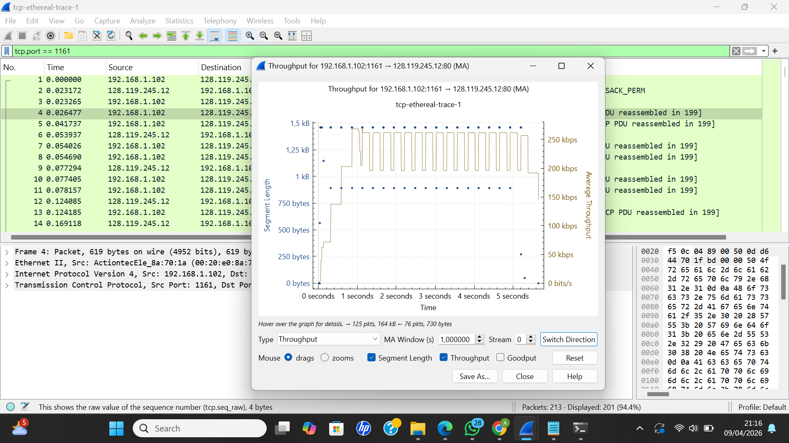

Throughput koneksi TCP diperoleh menggunakan fitur Statistics → TCP Stream Graph → Throughput pada Wireshark dengan filter tcp.port == 1161. Berdasarkan grafik yang ditampilkan, nilai throughput berada pada kisaran sekitar 200 kbps hingga 260 kbps. Nilai ini menunjukkan jumlah data yang berhasil ditransmisikan per satuan waktu selama proses komunikasi berlangsung.

## Congestion Control pada TCP
### Langkah-langkah
1. Pastikan masih memakai filter "tcp.port == 1161"
2. Lalu Statistics → TCP Stream Graph → Time-Sequence Graph (Stevens)

### Pertanyaan
1. Dapatkah mengidentifikasi slow start & congestion avoidance?

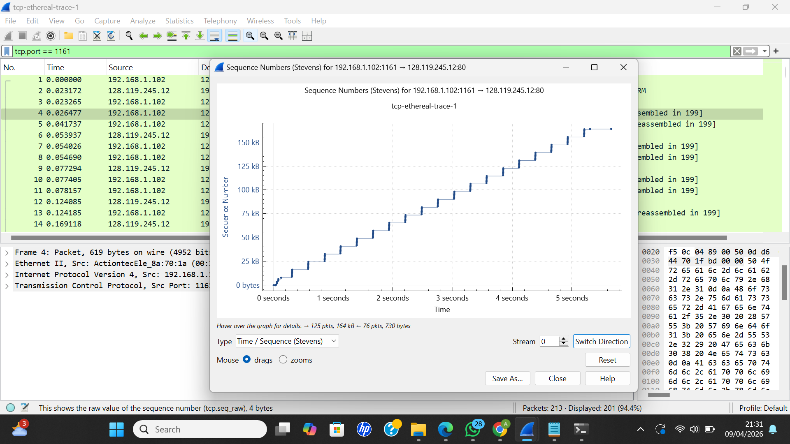

Berdasarkan grafik Time-Sequence Graph (Stevens), terlihat bahwa pada awal transmisi terjadi peningkatan jumlah data yang dikirim secara bertahap yang menunjukkan fase slow start. Setelah itu, peningkatan sequence number berlangsung lebih stabil dan linear yang menunjukkan bahwa mekanisme congestion avoidance mulai mengambil alih. Namun, peralihan antara kedua fase tersebut tidak terlihat secara jelas pada grafik.