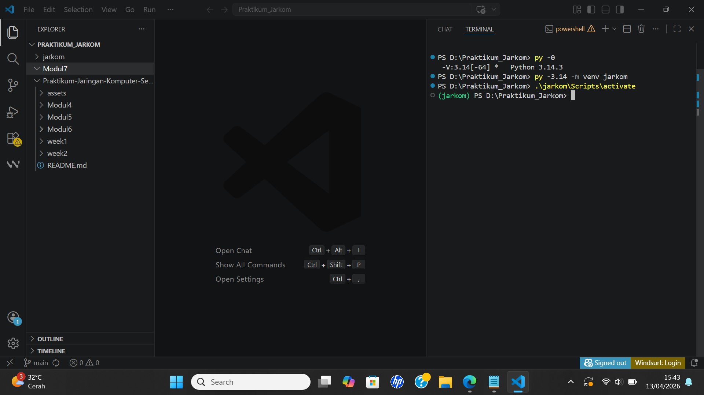
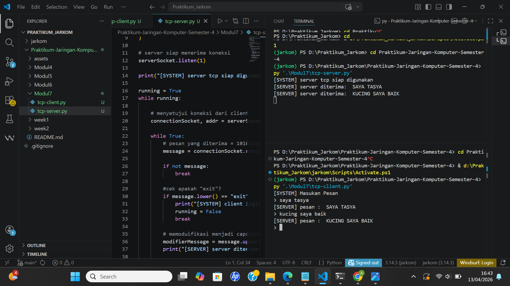
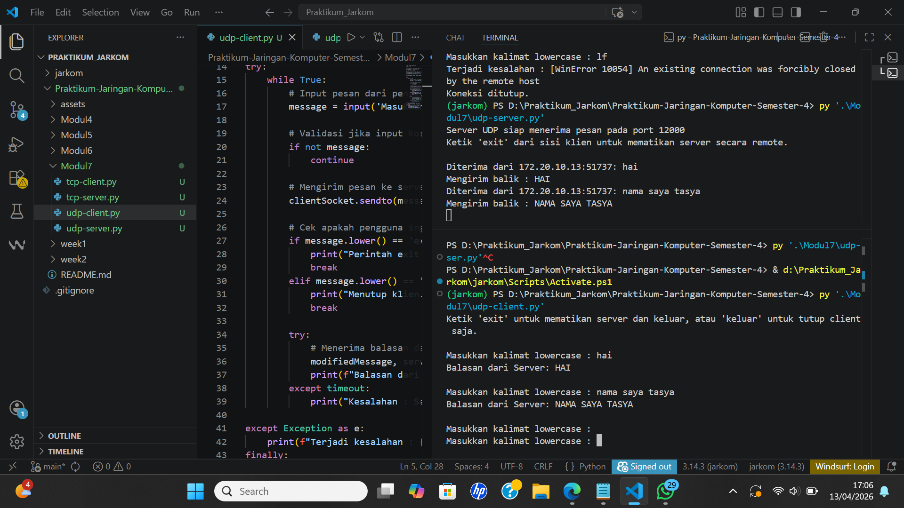

# MODUL 7 SOCKET PROGRAMMING: MEMBUAT APLIKASI JARINGAN 

Pada tahap awal praktikum, dilakukan pengecekan dan pembuatan virtual environment Python untuk memisahkan dependensi proyek.
1. Pengecekan versi Phyton

"py -0" Digunakan untuk melihat daftar versi Python yang terinstall pada komputer. Dari hasil tersebut, kita bisa memastikan versi Python yang akan digunakan dalam praktikum.

2. Membuat Virtual Environment

Penjelasan:
- py -3.14 → menjalankan Python versi 3.14
- -m venv → memanggil modul untuk membuat virtual environment
- jarkom → nama folder environment yang akan dibuat

Tujuannya untuk membuat file terpisah agar library atau package yang digunakan tidak bercampur dengan proyek lain.

3. Mengaktifkan Virtual Environment

Penjelasan:
- .\ → menunjuk ke folder saat ini
- jarkom → folder environment
- Scripts → lokasi file aktivasi
- activate → menjalankan environment

# Implementasi Program TCP
Setelah berhasil membuat dan mengaktifkan virtual environment, langkah selanjutnya adalah mengimplementasikan program menggunakan protokol TCP.

Pada tahap ini, dibuat dua buah program yang dipisahkan ke dalam file yang berbeda, yaitu:

- Program TCP Server (tcp-server.py) implementasi kode program terdapat pada file yang berbeda.
- Program TCP Client (tcp-client.py) implementasi kode program terdapat pada file yang berbeda.

Pemisahan ini dilakukan karena dalam konsep komunikasi jaringan, server dan client memiliki peran yang berbeda.

Contoh hasil output pada program TCP

# Implementasi Program UDP
Setelah berhasil mengimplementasikan program menggunakan protokol TCP, langkah selanjutnya adalah membuat program menggunakan protokol UDP.

Pada tahap ini, dibuat dua buah program yang dipisahkan ke dalam file yang berbeda, yaitu:

- Program UDP Server (udp-server.py) implementasi kode program terdapat pada file yang berbeda.
- Program UDP Client (udp-client.py) implementasi kode program terdapat pada file yang berbeda.

Pemisahan ini dilakukan karena dalam konsep jaringan komputer, server dan client memiliki peran yang berbeda.

Berbeda dengan TCP, protokol UDP bersifat connectionless, sehingga tidak memerlukan proses koneksi terlebih dahulu antara client dan server. Data dapat langsung dikirim tanpa memastikan apakah data tersebut diterima atau tidak.

Contoh hasil output pada program UDP

# Kesimpulan
Berdasarkan percobaan yang telah dilakukan, program komunikasi menggunakan protokol TCP dan UDP dapat berjalan dengan baik.

Pada TCP, komunikasi bersifat connection-oriented, dimana client harus melakukan koneksi terlebih dahulu ke server. Data yang dikirim dapat diterima dengan baik dan server memberikan respon sesuai input, sehingga komunikasi lebih andal.

Sedangkan pada UDP, komunikasi bersifat connectionless sehingga client dapat langsung mengirim data tanpa koneksi. Proses pengiriman menjadi lebih cepat, namun tidak ada jaminan data diterima, yang terlihat dari kemungkinan terjadinya timeout.

Dari percobaan ini dapat disimpulkan bahwa TCP lebih cocok untuk komunikasi yang membutuhkan keandalan, sedangkan UDP lebih cocok untuk komunikasi yang mengutamakan kecepatan.