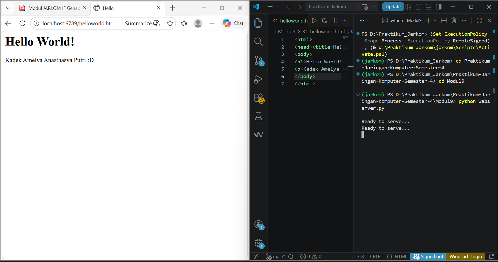
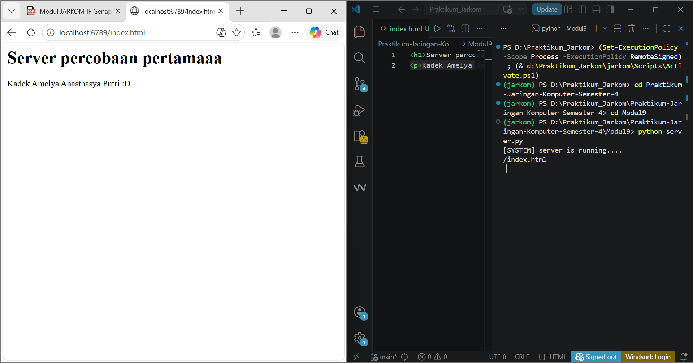
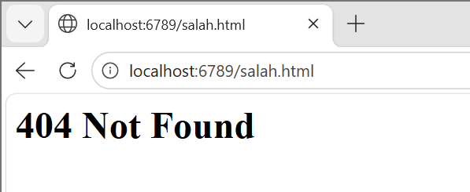

# MODUL 9 WEB SERVER

## Tujuan Praktikum
1. Memahami konsep dasar Web Server menggunakan Python.
2. Mengetahui cara kerja komunikasi client dan server menggunakan protokol HTTP.
3. Mampu membuat program web server sederhana menggunakan socket Python.
4. Mampu menangani request file HTML dari client/browser.
5. Memahami implementasi multi-client menggunakan threading.

## 9.5 Kode Python untuk Web Server
Pada percobaan ini dilakukan pelengkapan kode skeleton web server menggunakan Python. Program menggunakan socket TCP dengan port 6789. Server menunggu koneksi client, menerima request HTTP, membaca file HTML yang diminta, lalu mengirimkan isi file tersebut ke browser. Jika file tidak ditemukan, server memberikan respon 404 Not Found.

### Code program dan penjelasan code terdapat pada file terpisah (webserver.py & helloworld.html)

### Hasil :
- Program berhasil dijalankan.
- Browser dapat mengakses: http://localhost:6789/helloworld.html
- File HTML berhasil ditampilkan.

## 9.6 Latihan Tambahan
Pada latihan tambahan, server dikembangkan menjadi multithreaded menggunakan modul threading. Saat ada client yang terhubung, server membuat thread baru sehingga beberapa client dapat dilayani secara bersamaan.

Dengan metode ini, setiap koneksi request/response berjalan pada thread terpisah.

### Code program dan penjelasan code terdapat pada file terpisah (server.py & index.html)

### Hasil :
- Server mampu menerima lebih dari satu client.
- Client dapat mengakses file HTML secara bersamaan.
- Browser dapat mengakses: http://localhost:6789/index.html
- Jika file tidak tersedia, muncul halaman 404.

Jika client meminta file yang tidak tersedia pada folder server, maka program akan masuk ke blok except IOError dan mengirim respon 404 Not Found kepada browser.

## Kesimpulan
Berdasarkan praktikum Modul 9, dapat dipahami bahwa web server sederhana dapat dibuat menggunakan Python dengan memanfaatkan socket programming. Server mampu menerima request dari browser kemudian mengirimkan file HTML sesuai permintaan client.

Apabila file yang diminta tidak tersedia, server akan menampilkan pesan 404 Not Found sebagai respon error. Pada latihan tambahan, penggunaan threading membuat server dapat melayani beberapa client secara bersamaan dengan lebih efisien.
