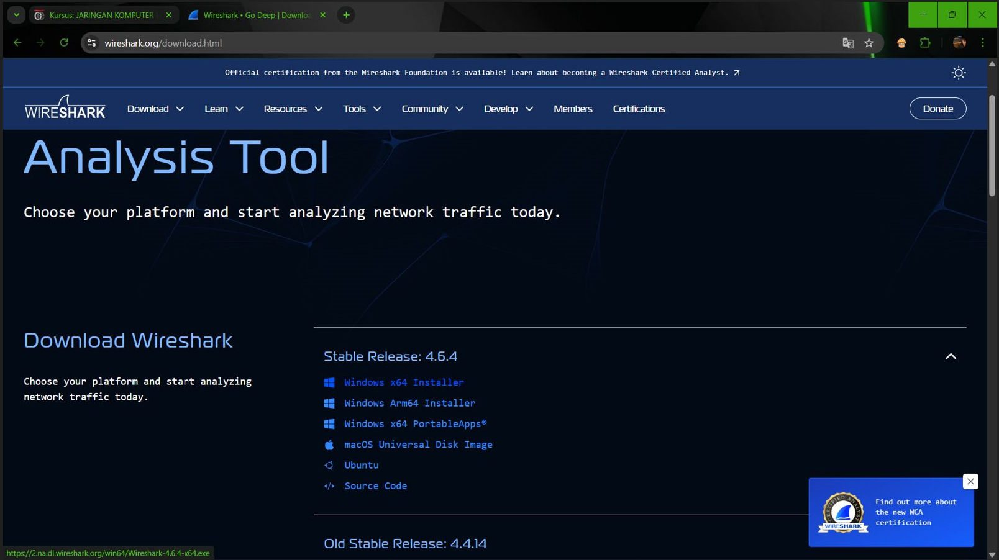
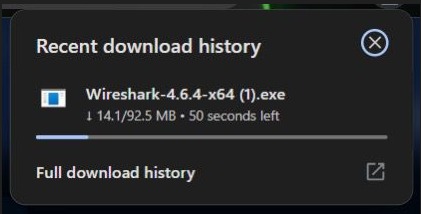
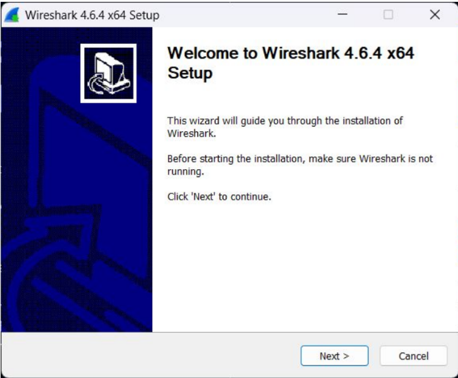
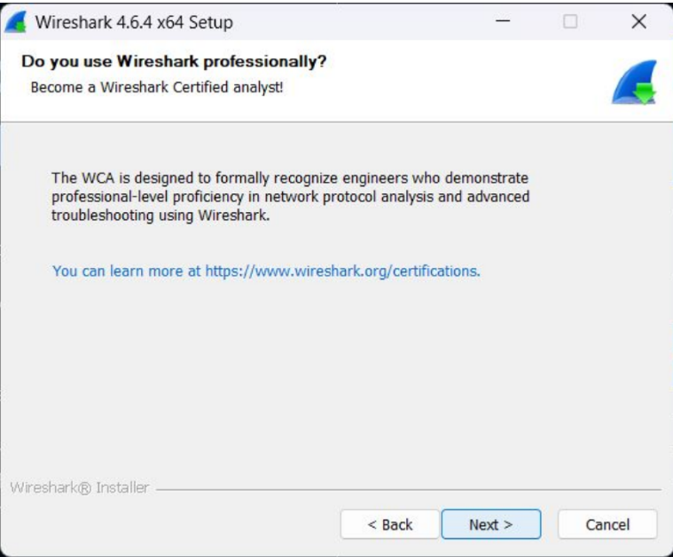
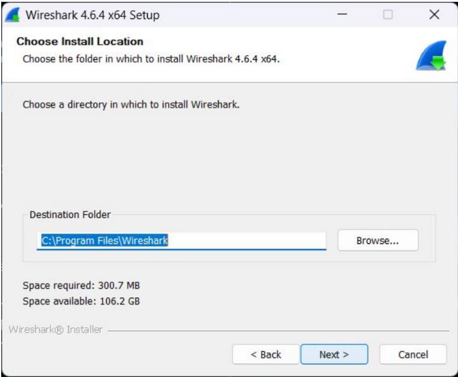
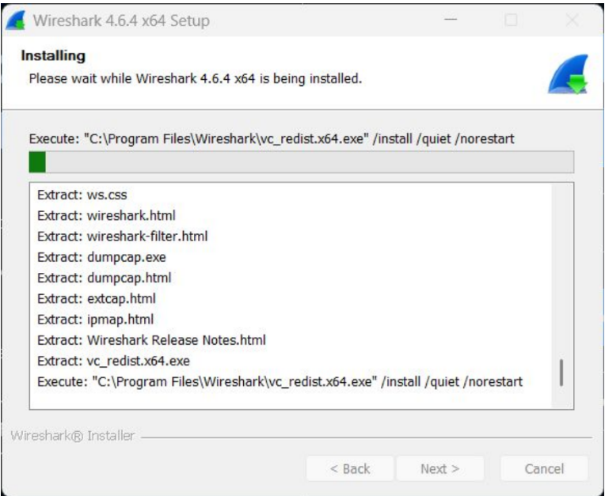
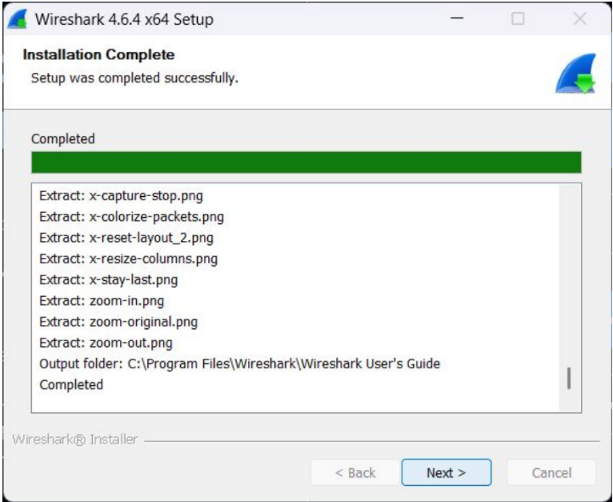
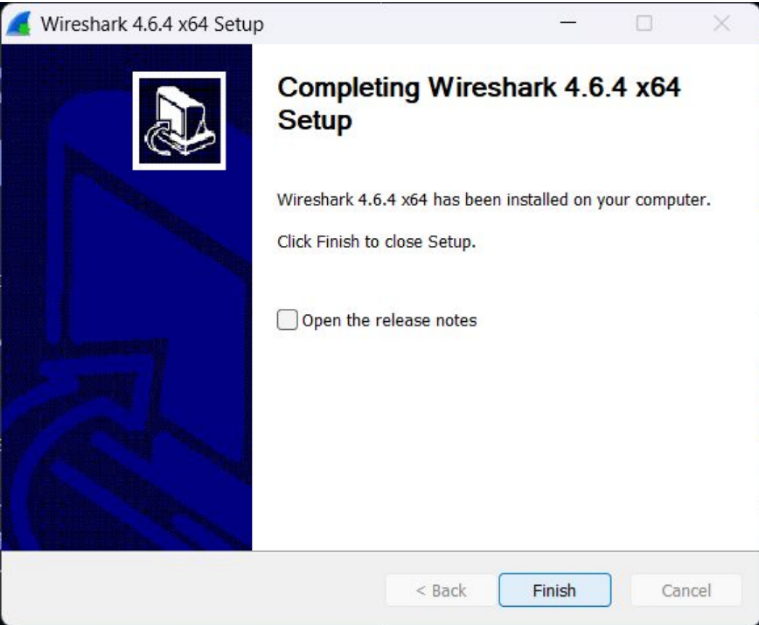

# MODUL 1 Instalasi Wireshark

## Download Wireshark:
1. Buka situs resmi wireshark.org/download.html di browser, lalu download installer Wireshark versi Windows x64.

2. Setelah setup wireshark terbuka, klik "Next" untuk memulai proses instalasi.

3. Pada halaman informasi mengenai Wireshark Certified Analyst (WCA), klik "Next" saja untuk lanjut ke tahap berikutnya.

4. Pilih folder tujuan instalasi. Secara default aplikasi akan terinstal di C:\Program Files\Wireshark. Pastikan space hardisk cukup, lalu klik "Next".

5. Tunggu proses ekstraksi file dan instalasi background (seperti Visual C++ Redistributable) sampai bar progres terisi penuh.

6. Setelah instalasi selesai (Completed), klik "Next" lalu klik "Finish" untuk menutup wizard.

