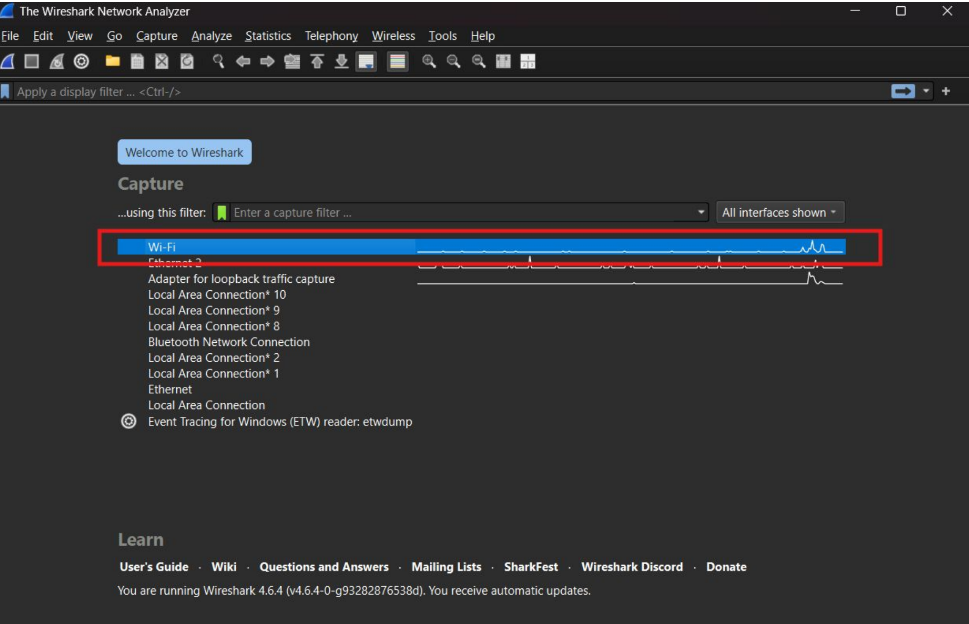
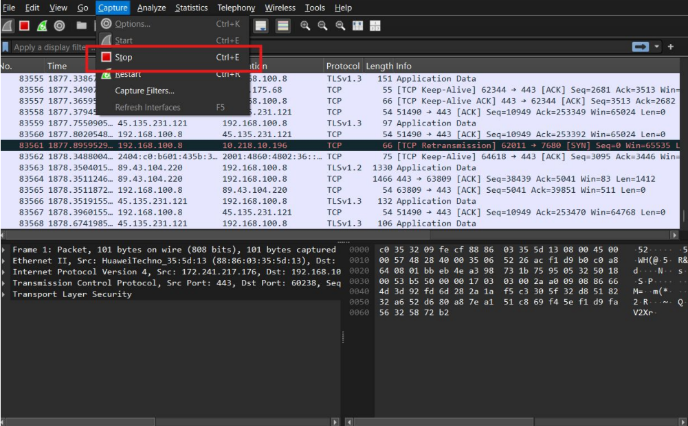
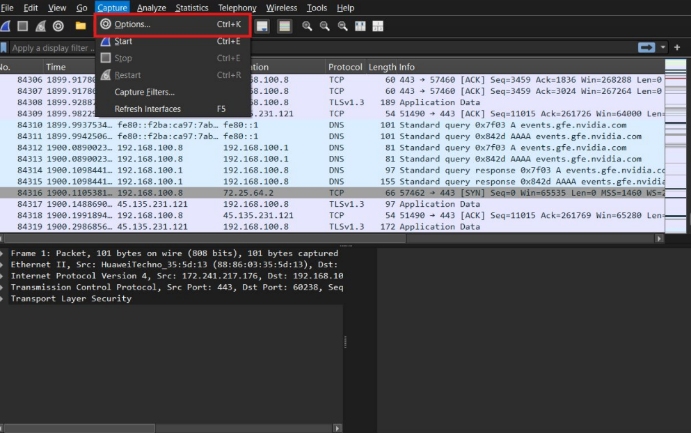
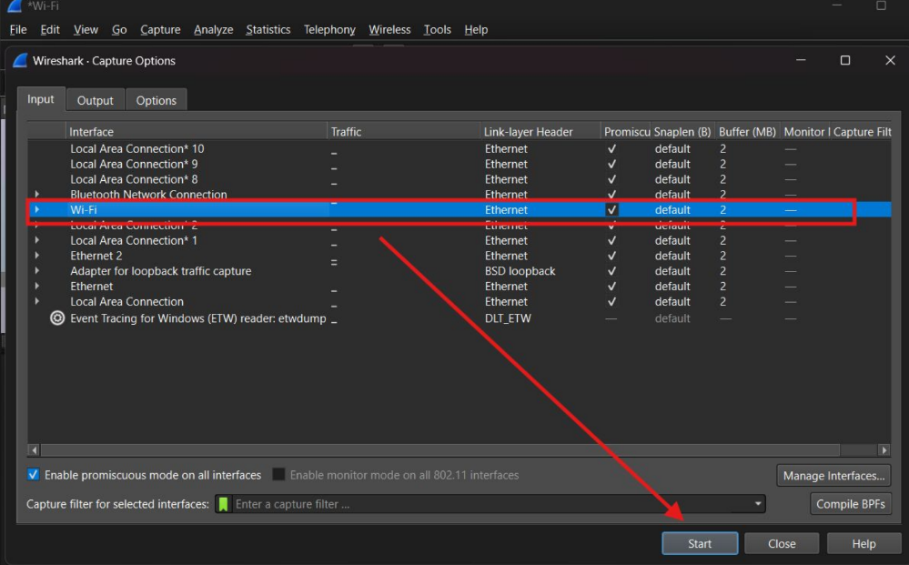
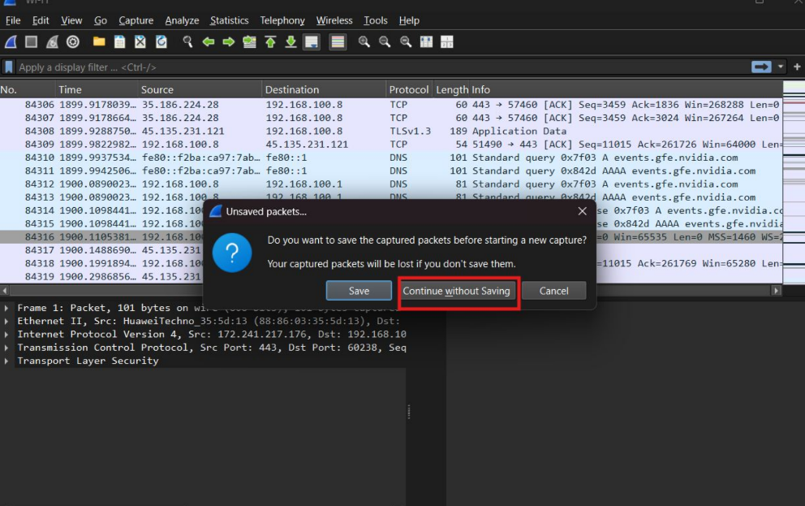
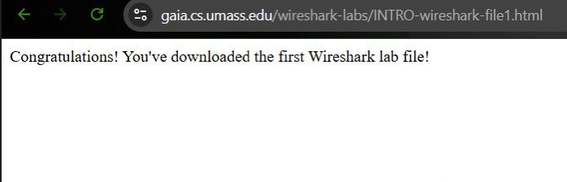
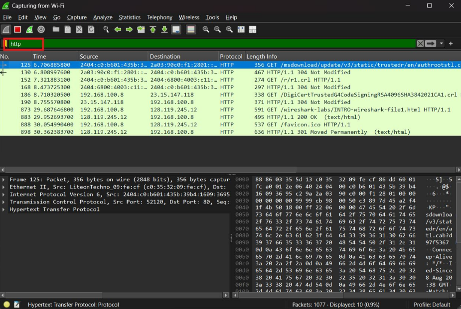
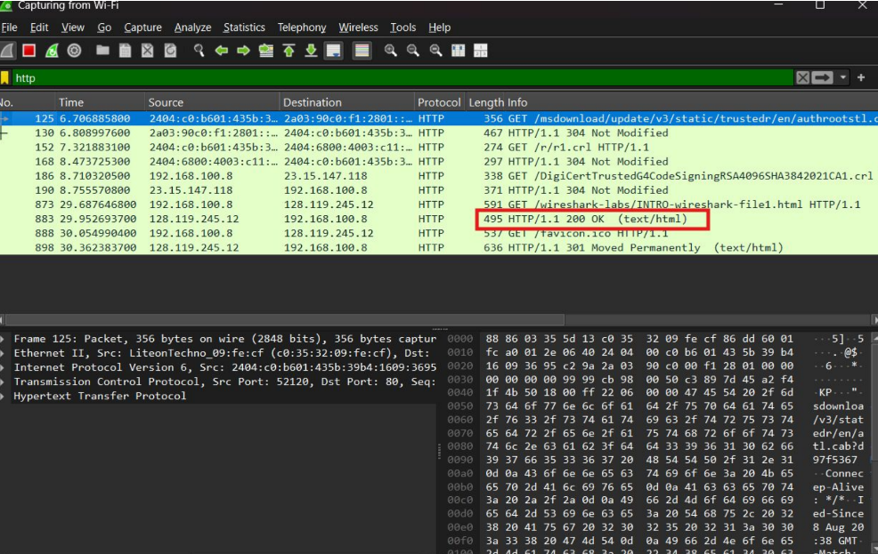
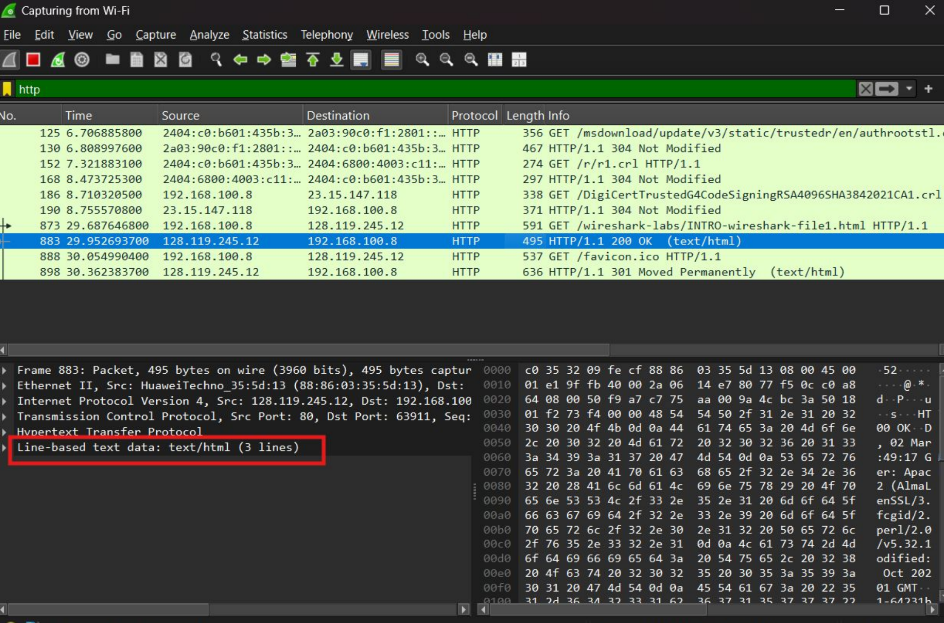
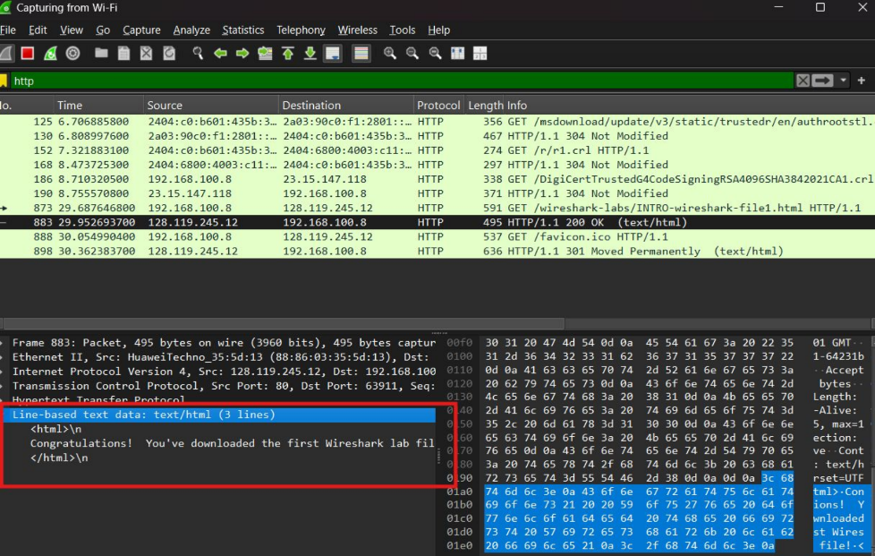

# MODUL 2 Pengenalan Tools

## Menggunakan Wireshark Untuk Proses Penangkapan dan Analisis Lalu Lintas Jaringan

1. Jalankan browser web
2. Inisialisasi Capture: Memilih antarmuka jaringan Wi-Fi dan memulai perekaman data (Start Capture).

3. Saat Wireshark sedang berjalan, masukkan URL: http://gaia.cs.umass.edu/wireshark labs/INTRO-wireshark-file1.html dan tampilkan halaman tersebut di browser (pastikan dengan format http bukan https).

## Filtering Data: 
Perekaman dihentikan (Stop), kemudian filter http diterapkan untuk mengisolasi dan hanya menampilkan paket data yang menggunakan protokol web HTTP.

## Identifikasi Paket: 
Ditemukan paket respons dari server (Paket No. 883) dengan status HTTP/1.1 200 OK, yang menandakan permintaan file berhasil.

## Membaca Payload: 
Pada panel detail paket, bagian Line-based text data diekspansi untuk melihat isi paket. Terlihat jelas source code HTML secara plaintext yang berisi pesan: "Congratulations! You've downloaded the first Wireshark lab file!".

