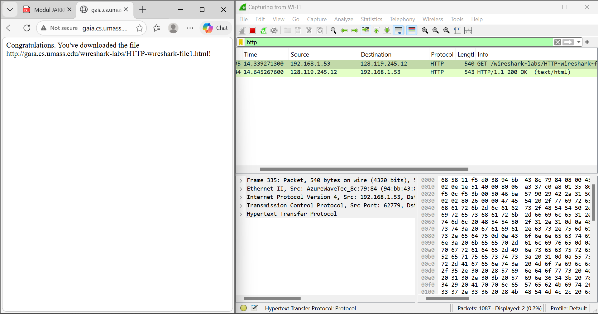
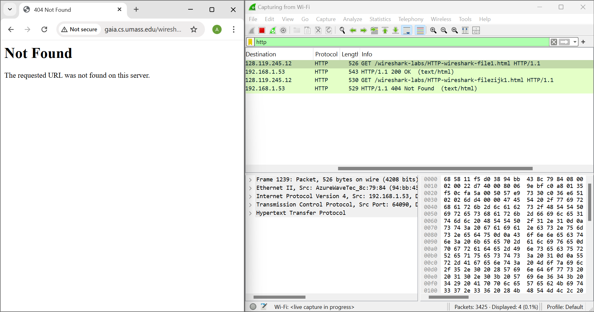
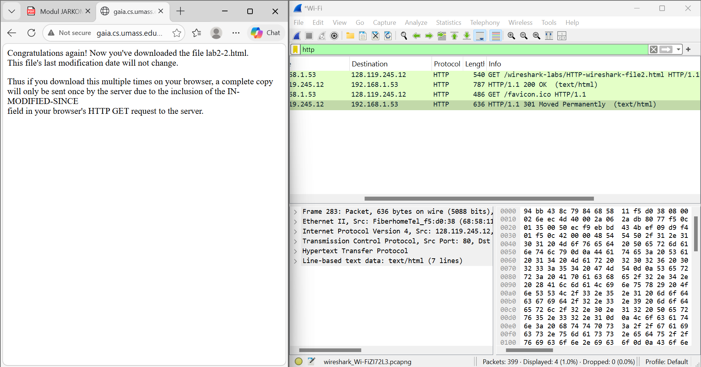
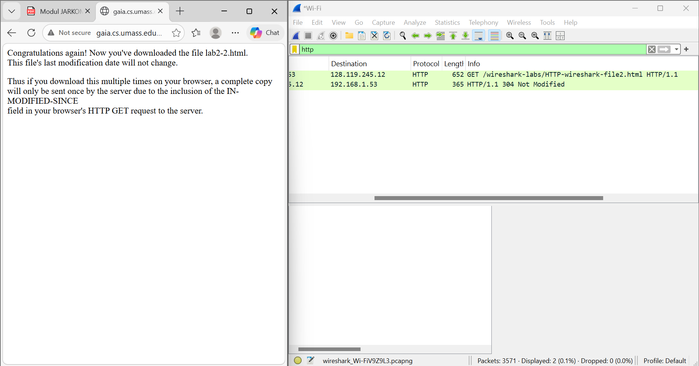
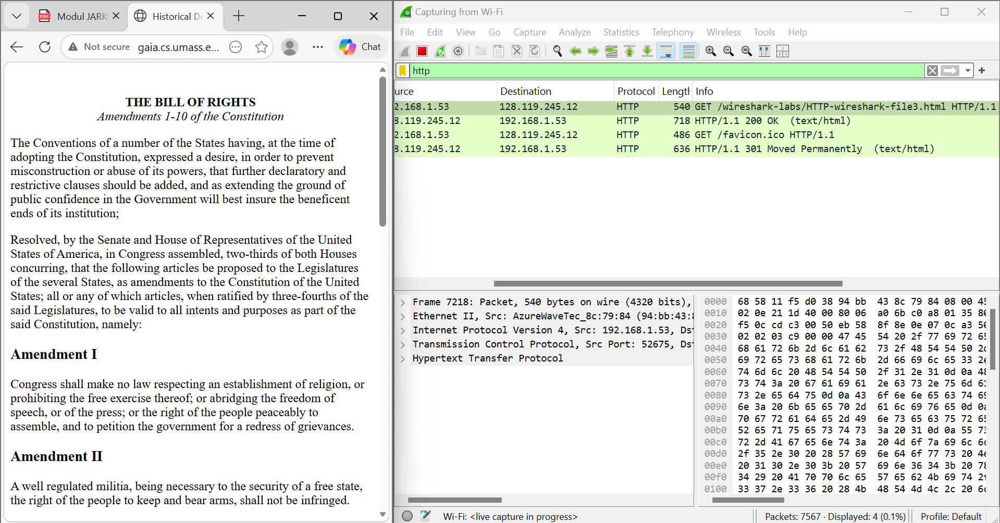
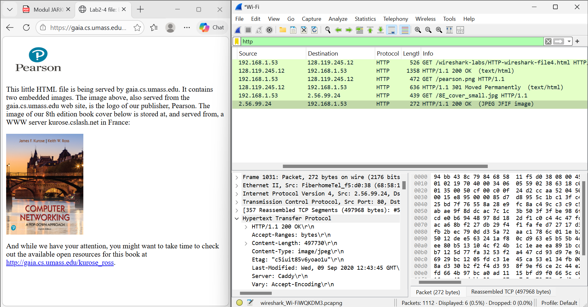
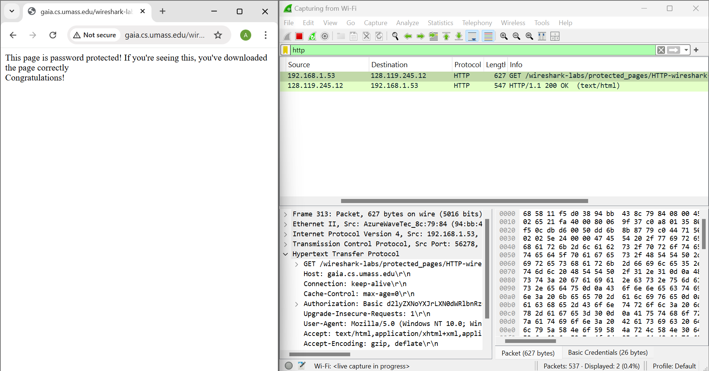

# MODUL 3 HTTP

Modul 3 mempelajari beberapa aspek protokol HTTP, seperti : the basic GET/responese interaction (interaksi dasar GET/response), HTTP message formats (format pesan HTTP), retrieving large HTML files (mengambil file HTML besar), retrieving HTML file with embedded objects (mengambil file HTML dengan objek yang disematkan), serta HTTP authentication and security (autentikasi dan keamanan HTTP).

## Basic HTTP GET/response interaction 
### Tujuan
Percobaan ini dilakukan untuk mengamati proses komunikasi dasar antara browser sebagai client dan web server melalui protokol HTTP, khususnya saat client mengirimkan HTTP GET request dan server memberikan HTTP response.

### Langkah-Langkah:
Buka browser, akses file http://gaia.cs.umass.edu/wireshark-labs/HTTP-wireshark-file1.html, lakukan capture paket HTTP pada Wireshark, lalu amati request dan response yang muncul.

Berdasarkan hasil pengamatan pada Wireshark, terlihat bahwa browser mengirimkan HTTP GET request ke server gaia.cs.umass.edu untuk meminta file HTTP-wireshark-file1.html. Permintaan tersebut ditunjukkan oleh paket dengan metode GET pada kolom Info.

Setelah menerima permintaan dari client, server memberikan balasan berupa HTTP/1.1 200 OK, yang menandakan bahwa request berhasil diproses dan file HTML dapat dikirimkan dengan baik ke browser.

Dari percobaan ini dapat disimpulkan bahwa proses Basic HTTP GET/response interaction berjalan normal, yaitu client mengirimkan permintaan file melalui metode GET, kemudian server merespons dengan status 200 OK sebagai tanda bahwa resource berhasil ditemukan dan dikirimkan.

Selain respons 200 OK, pada percobaan Basic HTTP GET/response interaction juga dapat diamati respons kesalahan dari server. Berdasarkan hasil capture Wireshark, pada paket No. 3283 browser mengirimkan request GET /wireshark-labs/HTTP-wireshark-filezijk1.html HTTP/1.1 ke server. Karena file tersebut tidak tersedia pada server, pada paket No. 3303 server memberikan respons HTTP/1.1 404 Not Found (text/html).

Hasil ini menunjukkan bahwa protokol HTTP tidak hanya menangani permintaan yang berhasil, tetapi juga menyediakan kode status untuk menandai kesalahan. Status 404 Not Found menandakan bahwa server menerima permintaan dari browser, tetapi sumber daya atau file yang diminta tidak ditemukan pada lokasi tersebut.

## HTTP CONDITIONAL GET/response interaction
### Tujuan
Percobaan ini bertujuan untuk mengamati bagaimana protokol HTTP menangani proses Conditional GET, yaitu mekanisme ketika browser meminta suatu file dengan mempertimbangkan apakah file tersebut sudah pernah disimpan sebelumnya. Melalui percobaan ini, dapat diamati bagaimana server merespons permintaan tersebut berdasarkan kondisi file yang diminta.

### Langkah-Langkah:
Buka browser, akses file http://gaia.cs.umass.edu/wireshark-labs/HTTP-wireshark-file2.html, lakukan capture paket HTTP pada Wireshark, lalu amati request dan response yang muncul.

Berdasarkan hasil capture Wireshark, pada paket No. 209 browser mengirimkan request GET /wireshark-labs/HTTP-wireshark-file2.html HTTP/1.1 ke server. Kemudian pada paket No. 243, server memberikan respons HTTP/1.1 200 OK (text/html) yang menunjukkan bahwa permintaan berhasil diproses dan file HTML berhasil dikirim ke browser.

Selain itu, muncul juga request GET /favicon.ico pada paket No. 245 yang merupakan permintaan otomatis browser untuk mengambil ikon halaman. Server kemudian merespons dengan HTTP/1.1 301 Moved Permanently (text/html) pada paket No. 283, namun hal ini bukan bagian utama dari percobaan.

Hasil ini menunjukkan bahwa browser berhasil meminta file HTTP-wireshark-file2.html dan server mengirimkan file tersebut secara langsung dengan status 200 OK. Pada percobaan Conditional GET, jika file belum tersedia di cache atau browser belum mengirimkan kondisi tertentu, maka server akan mengirimkan file seperti request HTTP biasa.

Selain respons 200 OK, pada percobaan ini juga diamati respons 304 Not Modified. Berdasarkan hasil capture Wireshark, pada paket No. 45 browser mengirimkan request GET /wireshark-labs/HTTP-wireshark-file2.html HTTP/1.1 ke server. Kemudian pada paket No. 51, server memberikan respons HTTP/1.1 304 Not Modified.

Respons 304 Not Modified menunjukkan bahwa file yang diminta sudah tersimpan di cache browser dan belum mengalami perubahan di server. Oleh karena itu, server tidak mengirimkan ulang isi file, melainkan browser cukup menggunakan salinan file yang sudah ada. Hal ini menunjukkan cara kerja HTTP Conditional GET, yaitu memeriksa kondisi file sebelum mengirimkan data kembali.

## Retrieving Long Documents 
### Tujuan
Percobaan ini bertujuan untuk mengamati bagaimana protokol HTTP menangani pengambilan dokumen HTML yang berukuran lebih besar. Pada file yang lebih panjang, data yang dikirim server umumnya tidak hanya terdiri dari satu paket, tetapi dapat terbagi ke dalam beberapa segmen selama proses transmisi.

### Langkah-Langkah:
Buka browser, akses file http://gaia.cs.umass.edu/wireshark-labs/HTTP-wireshark-file3.html, lakukan capture paket HTTP pada Wireshark, lalu amati request dan response yang muncul.

Berdasarkan hasil capture Wireshark, pada paket No. 7218 browser mengirimkan request GET /wireshark-labs/HTTP-wireshark-file3.html HTTP/1.1 ke server. Kemudian pada paket No. 7239, server memberikan respons HTTP/1.1 200 OK (text/html). Status 200 OK menunjukkan bahwa permintaan berhasil diproses dan file HTML berhasil dikirim ke browser.

Karena file HTTP-wireshark-file3.html merupakan dokumen yang lebih panjang, proses pengiriman data dapat melibatkan beberapa segmen TCP. Hal ini menunjukkan bahwa meskipun HTTP menggunakan mekanisme request–response, pengiriman dokumen berukuran besar tetap dibantu oleh TCP agar data dapat diterima secara lengkap.

Selain itu, muncul juga request GET /favicon.ico yang merupakan permintaan otomatis browser untuk mengambil ikon halaman. Respons 301 Moved Permanently yang muncul setelahnya bukan bagian utama percobaan, sehingga fokus analisis tetap pada request file utama dan response 200 OK.

## HTML Documents dengan Embedded Objects
### Tujuan
Percobaan ini bertujuan untuk mengamati bagaimana browser mengambil dokumen HTML yang di dalamnya terdapat objek tambahan (embedded objects), seperti gambar. Pada kondisi ini, browser tidak hanya meminta file HTML utama, tetapi juga mengirimkan request tambahan untuk mengambil objek-objek yang direferensikan di dalam halaman tersebut.

### Langkah-Langkah:
Buka browser, akses file http://gaia.cs.umass.edu/wireshark-labs/HTTP-wireshark-file4.html, lakukan capture paket HTTP pada Wireshark, lalu amati request dan response yang muncul.

Berdasarkan hasil capture Wireshark, pada paket No. 511 browser mengirimkan request GET /wireshark-labs/HTTP-wireshark-file4.html HTTP/1.1 ke server. Kemudian pada paket No. 531, server memberikan respons HTTP/1.1 200 OK (text/html) yang menandakan bahwa file HTML utama berhasil dikirim ke browser.

Setelah itu, browser mengirimkan request tambahan untuk objek yang ada di dalam halaman, yaitu GET /pearson.png HTTP/1.1 pada paket No. 532. Server merespons dengan HTTP/1.1 301 Moved Permanently (text/html) pada paket No. 562, yang menunjukkan bahwa objek tersebut dialihkan ke lokasi lain. Selanjutnya, browser mengirimkan request baru GET /8E_cover_small.jpg HTTP/1.1 pada paket No. 581, dan server merespons dengan HTTP/1.1 200 OK (JPEG JFIF image) pada paket No. 1031.

Hasil ini menunjukkan bahwa satu halaman HTML dapat menghasilkan beberapa request HTTP tambahan untuk mengambil objek-objek yang tertanam di dalamnya, seperti gambar.

## HTTP Authentication
### Tujuan
Percobaan ini bertujuan untuk mengamati bagaimana protokol HTTP menangani proses autentikasi ketika browser mengakses halaman yang dilindungi (protected page). Pada kondisi ini, browser perlu mengirimkan informasi autentikasi agar server dapat memberikan akses ke halaman tersebut.

### Langkah-Langkah:
Buka browser, akses file http://gaia.cs.umass.edu/wireshark-labs/protected_pages/HTTP-wireshark-file5.html, lakukan capture paket HTTP pada Wireshark, lalu amati request dan response yang muncul.

Berdasarkan hasil capture Wireshark, pada paket No. 313 browser mengirimkan request GET /wireshark-labs/protected_pages/HTTP-wireshark-file5.html HTTP/1.1 ke server. Kemudian pada paket No. 317, server memberikan respons HTTP/1.1 200 OK (text/html) yang menunjukkan bahwa permintaan berhasil diproses dan halaman HTML berhasil dikirim ke browser.

Hasil ini menunjukkan bahwa browser berhasil mengakses halaman yang dilindungi dan server memberikan respons 200 OK. Pada percobaan HTTP Authentication, proses autentikasi dilakukan melalui header Authorization Basic pada pesan HTTP GET. Informasi username dan password yang dikirim hanya dikodekan menggunakan format Base64, bukan dienkripsi secara langsung, sehingga data tersebut masih dapat di-decode kembali ke bentuk aslinya. Oleh karena itu, HTTP Basic Authentication pada koneksi HTTP biasa kurang aman apabila tidak disertai mekanisme keamanan tambahan seperti HTTPS.

